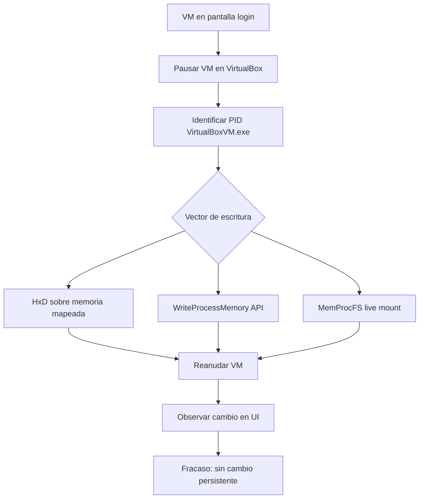

# Inyección de RAM

**Fecha de compilación:** 2026-06-07  
**Objetivo:** Máquina del Blue Team — Windows Server 2025 (VM VirtualBox `CSAI`)  
**Operador:** Red Team (ejercicio autorizado CSAI 2025)  
**Condición de victoria global:** Exfiltrar la Base de Datos y obtener shell como `NT AUTHORITY\SYSTEM`  
**Alcance:** Fase ofensiva de **escritura e inyección en RAM** (no lectura forense ni extracción BitLocker, aunque se referencian los prerrequisitos).


---

## Índice

1. [Resumen ejecutivo y contexto narrativo](#1-resumen-ejecutivo-y-contexto-narrativo)
2. [Contexto operativo y pivote estratégico](#2-contexto-operativo-y-pivote-estratégico)
3. [Infraestructura, artefactos y entorno](#3-infraestructura-artefactos-y-entorno)
4. [Prerrequisito: reconocimiento y localización de objetivos en RAM](#4-prerrequisito-reconocimiento-y-localización-de-objetivos-en-ram)
5. [Metodología I — Interfaz nativa VirtualBox (`VBoxManage debugvm`)](#5-metodología-i--interfaz-nativa-virtualbox-vboxmanage-debugvm)
6. [Metodología II — Protocolo GDB Remote Stub (socket TCP)](#6-metodología-ii--protocolo-gdb-remote-stub-socket-tcp)
7. [Metodología III — Depuración estilo VMware (vector descartado)](#7-metodología-iii--depuración-estilo-vmware-vector-descartado)
8. [Metodología IV — Acceso a RAM en caliente desde el SO host (congelar proceso)](#8-metodología-iv--acceso-a-ram-en-caliente-desde-el-so-host-congelar-proceso)
9. [Metodología V — WinDbg y depuración kernel](#9-metodología-v--windbg-y-depuración-kernel)
10. [Metodología VI — Parcheo offline sobre Save State (`.sav`)](#10-metodología-vi--parcheo-offline-sobre-save-state-sav)
11. [Metodología VII — Scripts Python y PowerShell (automatización de inyección)](#11-metodología-vii--scripts-python-y-powershell-automatización-de-inyección)
12. [Análisis integrado de resultados](#12-análisis-integrado-de-resultados)
13. [Problemas encontrados y lecciones aprendidas](#13-problemas-encontrados-y-lecciones-aprendidas)
14. [Mapeo MITRE ATT&CK](#14-mapeo-mitre-attck)
15. [Conclusiones y líneas futuras](#15-conclusiones-y-líneas-futuras)
16. [Anexos](#16-anexos)

---

## 1. Resumen ejecutivo y contexto narrativo

Tras agotar parcialmente la vía de extracción de claves BitLocker (FVEK/VMK) desde volcados RAM estáticos (`memoria.elf`, `.sav`, análisis Volatility3/MemProcFS y scripts de tallado en `intento_romper_bitlocker`), el Red Team pivotó hacia un vector alternativo de **compromiso físico/virtual**:

> **Inyectar o parchear directamente la memoria RAM de la VM en ejecución (o pausada) para alterar el comportamiento del sistema invitado**, con una prueba de concepto inicial orientada a modificar la pantalla de login de Windows Server 2025 y, en una fase posterior planificada, saltar la autenticación o ejecutar código privilegiado.

**Resultado global de la fase de inyección:** **No se consiguió una modificación funcional demostrable** (ningún cambio visible en la UI tras reanudar la VM, ninguna ejecución de código arbitrario). Sin embargo, la investigación fue **exhaustiva y reproducible**, documentando:

- Múltiples primitivas de hipervisor probadas (`VBoxManage`, GDB RSP).
- Intentos de escritura directa sobre el proceso `VirtualBoxVM.exe` del host (HxD, `WriteProcessMemory`).
- Evaluación de WinDbg kernel (bloqueado por contramedidas y colapsos del hipervisor).
- Experimento controlado con cadena conocida (`HOLAHOLAHOLA`) sobre Save State.
- Automatización mediante scripts Python y PowerShell con heurísticas de payload UTF-16LE y checksum GDB.

**Hallazgo técnico principal:** VirtualBox 7.2.6 **acepta** comandos GDB sobre el puerto TCP 1234 (ACK de paquetes válidos), pero **rechaza escrituras** (`E81`) en páginas protegidas por la MMU/EPT del guest Windows Server 2025. La API `setregisters MEM:` está **formalmente expuesta pero no implementada** en el backend COM (`0x80004001`).

### 1.1 Relato narrativo del proceso

El objetivo de esta fase era realizar la inyección y modificación de código en la memoria RAM de la máquina virtual (VM) en ejecución.

Inicialmente, se planteó inyectar código en el proceso de inicio de sesión para omitir la autenticación o abrir una consola de comandos (`cmd.exe`). Como prueba de concepto (PoC), se intentó escribir la cadena `HOLA_MUNDO` en la RAM, sustituyendo los caracteres de un mensaje de texto que se mostraba en la pantalla de login.

A lo largo de la investigación, se probaron diversos métodos:
1. **Depurador de VirtualBox:** Se intentó inyectar el código a través de la interfaz de depuración nativa del hipervisor, pero los comandos de escritura fueron bloqueados.
2. **Archivos de estado guardado (`.sav`):** Se exploró la modificación directa de los archivos `.sav` generados al pausar la VM, pero la compresión LZF y el cifrado de las estructuras dificultaron el parcheo offline.
3. **Suspensión de proceso y edición en vivo:** Se suspendió el proceso `VirtualBoxVM.exe` a nivel del sistema operativo anfitrión (host) con el fin de manipular el segmento de RAM asignado. Se utilizaron herramientas como *HxD* y se intentó la ejecución con privilegios de `SYSTEM`. Sin embargo, el hipervisor denegó los permisos de escritura o no persistió los cambios tras reanudar el proceso, posiblemente debido a la necesidad de contar con privilegios de Ring 0 en el host.
4. **Depuración remota con WinDbg:** Se intentó establecer una sesión de depuración de kernel, lo cual requirió desactivar medidas de seguridad del host (como `hypervisorlaunchtype off`). Aunque se logró interactuar con el depurador, los intentos de escritura provocaron una inestabilidad severa en el hipervisor, resultando en el colapso de la máquina virtual bajo la excepción *Guru Meditation* de VirtualBox.

En conclusión, la inyección directa en RAM no fue exitosa debido a las fuertes restricciones de protección de páginas (EPT/W^X) y la necesidad de eludir protecciones del kernel de Windows Server 2025 y las del propio hipervisor.

---

## 2. Contexto operativo y pivote estratégico

### 2.1 Situación previa: lectura RAM / BitLocker

Los directorios analizados para este informe fueron:

| Ruta | Contenido relevante para inyección |
|------|-------------------------------------|
| `RedTeam/` | Informes de intentos (`Intentos/`), scripts (`inyectar.py`), notas (`Inyeccion/inyeccion.md`), volcados `.elf` |
| `intento_romper_bitlocker/` | Extracción FVEK (lectura); pivote documentado hacia inyección tras fracaso de montaje en Kali |
| `RedTeam/ (copia externa)` | Scripts de análisis de volcados (`AnalisisDeVolcados/`); sin scripts de inyección directa |

La fase de **lectura** confirmó presencia de estructuras BitLocker (`FVEp`, `FVE0`, `Cngb`, `TpmP`) pero no produjo una clave montable. Eso empujó la estrategia hacia **modificación activa de RAM** como vector de escalada local dentro del guest.

### 2.2 Objetivo táctico de la inyección

| Fase | Objetivo | Criterio de éxito |
|------|----------|-------------------|
| **PoC visual** | Sustituir texto de la pantalla de login (p. ej. `"Presione Ctrl+Alt+Supr..."` → `"HOLA_MUNDO"`) | Cambio observable al reanudar la VM |
| **PoC de control** | Introducir cadena conocida (`HOLAHOLAHOLA`) y localizarla en memoria congelada | Offset reproducible en `.sav` / `.elf` |
| **Objetivo final (planificado, no alcanzado)** | Inyectar shellcode o parchear flujo de `LogonUI.exe` / `winlogon.exe` para bypass de login | Sesión interactiva sin credenciales |

### 2.3 Hipótesis de ataque

Con control total del hipervisor (`.vbox`, `.vdi`, `.nvram`, `.sav`, volcados `.elf`), se planteó:

1. Pausar o guardar estado la VM en pantalla de login.
2. Localizar en RAM una estructura modificable (texto UI, buffer de credenciales, código de proceso privilegiado).
3. Escribir bytes controlados (UTF-16LE para strings, o shellcode para ejecución).
4. Reanudar la ejecución y observar el efecto.

Esta hipótesis es **teóricamente válida** en entornos de laboratorio con hipervisor comprometido; la dificultad real reside en **identificar offsets estables** y **superar protecciones de página** (W^X, EPT, compresión de memoria del guest).

---

## 3. Infraestructura, artefactos y entorno

### 3.1 Configuración de la VM objetivo (extracto `.vbox`)

| Parámetro | Valor | Implicación para inyección |
|-----------|-------|----------------------------|
| Nombre | `CSAI` | Target de todos los comandos `VBoxManage` |
| SO | Windows Server 2025 (`Windows2022_64`) | Login UI moderna, UTF-16LE, posible Memory Compression |
| RAM | 4096 MB | Volcados ~4 GB; búsqueda de offsets costosa |
| Firmware | EFI + vTPM 2.0 | BitLocker activo; no afecta directamente a inyección UI |
| VirtualBox | 7.2.6 (r172322) | Guest Debug Provider GDB en TCP 1234 |
| Red | Host-Only `192.168.56.137` | Sin vector remoto; ataque desde host Windows 11 |

### 3.2 Artefactos de memoria utilizados

| Artefacto | Comando / origen | Uso en fase inyección |
|-----------|------------------|----------------------|
| `memoria.elf` | `VBoxManage debugvm "CSAI" dumpvmcore --filename=...` | Búsqueda offline de offsets (texto login) |
| `*.sav` | Machine → Save State / pausar VM | Intento de parcheo offline (Intento 5) |
| Puerto TCP `1234` | `VBoxManage modifyvm "CSAI" --guest-debug-provider=gdb --guest-debug-io-provider=tcp --guest-debug-port=1234` | Escritura en vivo vía GDB `M` |
| Proceso host `VirtualBoxVM.exe` | PID observado: `25676`, `12964` (según sesión) | Escritura vía `WriteProcessMemory` sobre RAM emulada |

### 3.3 Cadena objetivo y payload de prueba

**Texto original buscado en volcado (UTF-16LE):**

```text
Presiona Ctrl+Alt+Supr para desbloquear.
```

**Representación hexadecimal (fragmento inicial):**

```hex
500072006500730069006F006E006100
```

**Cadena completa en hex (desde `Inyeccion/inyeccion.md`):**

```hex
500072006500730069006F006E00610020004300740072006C002B0041006C0074002B00530075007000720020007000610072006100200064006500730062006C006F00710075006500610072002E00
```

**Payload de reemplazo PoC (`HOLA_MUNDO`, UTF-16LE, 20 bytes / 0x14):**

```hex
48004F004C0041005F004D0055004E0044004F00
```

**Variante con padding de espacios (Intento II.1, colchón de limpieza):**

```hex
48004f004c0041005f004d0055004e0044004f0020002000200020002000
```

### 3.4 Herramientas desplegadas (por categoría)

| Categoría | Herramientas |
|-----------|--------------|
| Hipervisor | `VBoxManage`, VirtualBox Manager GUI |
| Depuración remota | GDB RSP sobre TCP, sockets Python/PowerShell |
| Editores binarios | HxD, HexEd.it (PWA), búsqueda visual previa a scripts |
| Forense en vivo | MemProcFS (`MemProcFS.exe`) |
| Depuración kernel | WinDbg (requiere `bcdedit /set hypervisorlaunchtype off`) |
| Privilegios host | PsExec (`psexec -i -s`) para contexto SYSTEM |
| Automatización | `inyectar.py`, scripts PowerShell embebidos en informes |

---

## 4. Prerrequisito: reconocimiento y localización de objetivos en RAM

> **Nota:** Esta sección resume la fase de **lectura** documentada en `Intentos/intento1LecturaRam.md` e `Intento5LecturaRam.md`, necesaria para entender de dónde salieron los offsets usados en los intentos de **escritura**.

### 4.1 INTENTO L.1 — Búsqueda indexada en volcado estático (`.elf`)

| Campo | Detalle |
|-------|---------|
| **Qué se buscaba** | Offset físico de la cadena *"Presione Ctrl+Alt+Supr..."* en pantalla de login |
| **Cómo** | Procesar `volcado.elf` / `memoria.elf` con editor hex o búsqueda de patrón UTF-16LE |
| **Resultado** | **ÉXITO de localización:** dos direcciones tentativas: `0x2DEDD0F0` y `0x7B9AF5C` |
| **Matiz crítico** | Offsets del `.elf` son **direcciones físicas indexadas en el dump estático**; no garantizan mapeo 1:1 con direcciones que acepta el GDB Stub en caliente |

**Comando de obtención del volcado:**

```powershell
VBoxManage debugvm "CSAI" dumpvmcore --filename="KaliShared/memoria.elf"
```

**Nota operativa (`Inyeccion/inyeccion.md`):** se anotó que `dumpguestcore` podría ser preferible para análisis; se usó principalmente `dumpvmcore`.

### 4.2 INTENTO L.2 — Búsqueda directa en `.sav` (LZF)

| Campo | Detalle |
|-------|---------|
| **Qué se buscaba** | Mismo patrón UTF-16LE en archivo Save State (~500 MB comprimido) |
| **Resultado** | **FALLO** — cero coincidencias |
| **Causa** | VirtualBox 7.x comprime RAM con **LZF**; cadenas no existen en texto plano en disco |

### 4.3 INTENTO L.3 — Cliente GDB interactivo

| Campo | Detalle |
|-------|---------|
| **Comando** | `(gdb) target remote 127.0.0.1:1234` |
| **Resultado** | **FALLO** — `Connection timed out` |
| **Causa** | Handshake estricto; conflicto con estado pausado/ejecutando en VBox 7.2.6 |

### 4.4 INTENTO L.4 — Handshake manual PowerShell (`$?#3f`)

| Campo | Detalle |
|-------|---------|
| **Resultado** | **ÉXITO PARCIAL** — respuesta inicial `$` |
| **Limitación** | El stub no completó volcado de registros/memoria; canal degradado |

### 4.5 INTENTO L.5 — Lectura previa a escritura (`m<addr>,<len>`)

| Campo | Detalle |
|-------|---------|
| **Paquete enviado** | `$m7b9af5c,14#00` (20 bytes desde `0x7B9AF5C`) |
| **Resultado** | **FALLO** — `$T05thread:01;#07` (SIGTRAP), pérdida de sincronía |
| **Interpretación** | Región de memoria baja asignada a kernel (Ring 0); EPT bloquea lectura externa |

### 4.6 Direcciones adicionales anotadas

| Dirección | Contexto |
|-----------|----------|
| `0x1DF879E914C` | Dirección virtual anotada para intento `WriteProcessMemory` sobre `VirtualBoxVM.exe` |
| `0x1F91F5EC2F0` | Dirección usada en script PowerShell de inyección de `"HOLA"` (4 bytes ASCII) |

---

## 5. Metodología I — Interfaz nativa VirtualBox (`VBoxManage debugvm`)

**MITRE ATT&CK:** T1565.001 (Stored Data Manipulation), T1610 (Deploy Container — analogía hipervisor)

### 5.1 Configuración previa del canal de depuración

```powershell
VBoxManage modifyvm "CSAI" --guest-debug-provider=gdb --guest-debug-io-provider=tcp --guest-debug-port=1234

VBoxManage showvminfo "CSAI" | Select-String "Debug"
```

### 5.2 INTENTO I.1 — Escritura directa en espacio físico (`MEM:`)

| Campo | Valor |
|-------|-------|
| **Objetivo** | Escribir payload `HOLA_MUNDO` en offset `0x2DEDD0F0` vía registro virtual `MEM:` |
| **Comando** | Ver abajo |
| **Resultado** | **FALLO** |
| **Error** | `Method MachineDebugger::setRegister is not implemented (0x80004001)` |

```powershell
VBoxManage debugvm "CSAI" setregisters "MEM:0x2DEDD0F0=48004F004C0041005F004D0055004E0044004F00"
```

**Análisis técnico:**

- La sintaxis `MEM:<offset>=<hex>` aparece documentada en la ayuda de `debugvm`, pero el envoltorio COM `MachineDebuggerWrap` de VirtualBox **7.x no implementa** la manipulación de punteros a memoria física en caliente.
- Es un bloqueo de **estabilidad del host**, no un fallo de sintaxis del operador.
- Implica que la vía CLI nativa para parcheo directo de RAM **no está operativa** en esta versión.

### 5.3 INTENTO I.2 — Prueba de aislamiento (registro CPU `rax`)

| Campo | Valor |
|-------|-------|
| **Objetivo** | Verificar si `setregisters` funciona para registros CPU pero no para `MEM:` |
| **Comando** | `debugvm "CSAI" setregisters "rax=0x1"` |
| **Resultado** | **ÉXITO DE CONTROL** — comando aceptado en silencio |
| **Efecto visible** | Ninguno en pantalla de login |
| **Conclusión** | `setregisters` opera sobre **registros del procesador emulado**, no sobre RAM arbitraria |

**Tabla comparativa Intentos I.1 vs I.2:**

| Aspecto | I.1 (`MEM:`) | I.2 (`rax`) |
|---------|--------------|-------------|
| Aceptación API | Rechazado (`0x80004001`) | Aceptado |
| Modifica RAM guest | No | No |
| Modifica estado CPU | N/A | Sí (registro interno) |
| Utilidad para bypass login | Ninguna | Ninguna (sin correlación con UI) |

---

## 6. Metodología II — Protocolo GDB Remote Stub (socket TCP)

**MITRE ATT&CK:** T1055 (Process Injection — primitiva de escritura remota), T1622 (Debugger Evasion — uso inverso del debugger del hipervisor)

### 6.1 Fundamentos del protocolo RSP (Remote Serial Protocol)

| Elemento | Descripción |
|----------|-------------|
| **Transporte** | TCP `127.0.0.1:1234` (expuesto por VirtualBox Guest Debug Provider) |
| **Formato trama** | `$<comando>#<checksum_mod_256>` |
| **Comando escritura** | `M<addr_hex>,<len_hex>:<data_hex>` |
| **Comando lectura** | `m<addr_hex>,<len_hex>` |
| **Checksum** | $\text{Checksum} = \left(\sum \text{ASCII}(\text{cmd})\right) \bmod 256$ |
| **Respuestas típicas** | `+` ACK, `-` NACK, `+$E81#AE` error memoria, `$T05` SIGTRAP |

### 6.2 INTENTO II.1 — Inyección Python en dirección alta (`0x2DEDD0F0`)

| Campo | Valor |
|-------|-------|
| **Script** | `patch.py` (documentado en `intento1InyeccionRam.md`; lógica equivalente en `inyectar.py` con offset distinto) |
| **Offset** | `0x2DEDD0F0` |
| **Payload** | `HOLA_MUNDO` + espacios de padding |
| **Resultado** | **FALLO** |

**Script empleado (`patch.py`):**

```python
import socket
HOST, PORT = '127.0.0.1', 1234
OFFSET = 0x2DEDD0F0
PATCH_HEX = "48004f004c0041005f004d0055004e0044004f0020002000200020002000"
cmd = f"M{OFFSET:x},{len(PATCH_HEX)//2:x}:{PATCH_HEX}"
packet = f"${cmd}#{sum(cmd.encode()) % 256:02x}"
with socket.socket(socket.AF_INET, socket.SOCK_STREAM) as s:
    s.connect((HOST, PORT))
    s.sendall(packet.encode())
    print("Respuesta:", s.recv(1024).decode())
```

**Respuesta observada:**

```text
+$E81#AE
(precedido por interrupciones $T05thread:01;#07)
```

**Interpretación:**

| Señal | Significado |
|-------|-------------|
| `+` inicial | Paquete recibido; checksum válido |
| `$E81` | **Error de acceso a memoria** — escritura denegada |
| `$T05` | **SIGTRAP** — CPU virtual detenida en punto de depuración |
| Causa raíz | Página con atributo **solo lectura (W=0)** en MMU virtualizada; texto de login en región no escribible vía stub |

### 6.3 INTENTO II.2 — Inyección PowerShell en dirección baja (`0x7B9AF5C`)

| Campo | Valor |
|-------|-------|
| **Script** | `inyectar.ps1` (documentado en informe agente) |
| **Offset** | `0x7B9AF5C` (~123 MB — región baja) |
| **Mejora** | `Start-Sleep -Milliseconds 500` para evitar cierre prematuro del socket |
| **Resultado** | **FALLO CRÍTICO** |

**Respuesta:**

```text
$T05thread:01;#07$T05thread:01;#07$T05thread:01;#07
```

(Sin confirmación `+` de escritura)

**Interpretación:**

- Impacto en zona protegida del **kernel de Windows Server 2025**.
- El hipervisor **deniega escritura** para evitar BSOD / corrupción del núcleo.
- El socket queda en estado de **desincronización** tras múltiples SIGTRAP.

**Script PowerShell (`inyectar.ps1`):**

```powershell
$OFFSET = "7b9af5c"
$PATCH = "48004f004c0041005f004d0055004e0044004f00"
$len = ($PATCH.Length / 2).ToString("x")
$gdb_cmd = "M$($OFFSET),$($len):$($PATCH)"
$checksum = 0
[System.Text.Encoding]::ASCII.GetBytes($gdb_cmd) | ForEach-Object { $checksum = ($checksum + $_) % 256 }
$packet = "`$$gdb_cmd#$($checksum.ToString('x2'))"
$client = New-Object System.Net.Sockets.TcpClient("127.0.0.1", 1234)
$stream = $client.GetStream()
$data = [System.Text.Encoding]::ASCII.GetBytes($packet)
$stream.Write($data, 0, $data.Length)
Start-Sleep -Milliseconds 500
if ($stream.DataAvailable) {
    $buf = New-Object Byte[] 1024
    $res = $stream.Read($buf, 0, $buf.Length)
    Write-Host "Respuesta: $([System.Text.Encoding]::ASCII.GetString($buf, 0, $res))"
}
$client.Close()
```

### 6.4 INTENTO II.3 — Escritura atómica unitaria (1 byte)

| Campo | Valor |
|-------|-------|
| **Objetivo** | Descartar que el error `E81` sea por **tamaño** del payload (>4 KB page boundary) |
| **Paquete** | `$M2dedd0f0,1:48#60` (un solo byte `0x48` = `'H'`) |
| **Resultado** | **FALLO** — `+$E81#AE` idéntico al intento multi-byte |
| **Conclusión** | La restricción es el **flag de protección de página (EPT/W^X)**, no la longitud del patch |

### 6.5 INTENTO II.4 — Script Python consolidado (`inyectar.py`)

| Campo | Valor |
|-------|-------|
| **Archivo** | `inyectar.py` |
| **Offset** | `0x07B9AF5C` (segunda dirección del volcado `.elf`) |
| **Payload** | `48004f004c0041005f004d0055004e0044004f00` (`HOLA_MUNDO` UTF-16LE) |
| **Resultado** | **FALLO** (misma familia de errores SIGTRAP / E81 según sesión) |

> Ver sección [11](#11-metodología-vii--scripts-python-y-powershell-automatización-de-inyección) para análisis detallado de heurísticas del script.

### 6.6 Tabla resumen Metodología II

| ID | Offset | Herramienta | Bytes | ACK | Error | Causa |
|----|--------|-------------|-------|-----|-------|-------|
| II.1 | `0x2DEDD0F0` | Python `patch.py` | 28 | Parcial | E81 | Página RO (UI / MMU) |
| II.2 | `0x7B9AF5C` | PowerShell | 20 | No | T05×3 | Región kernel |
| II.3 | `0x2DEDD0F0` | Paquete manual | 1 | Sí | E81 | Protección EPT |
| II.4 | `0x07B9AF5C` | `inyectar.py` | 20 | No | T05/E81 | Kernel / RO |

---

## 7. Metodología III — Depuración estilo VMware (vector descartado)

**Referencia:** Esquema en `recopilacion2.md` — *"Intento mediante debug de VMWare: no permite operaciones de escritura"*.

### 7.1 Contexto

El hipervisor real del laboratorio es **Oracle VirtualBox 7.2.6**, no VMware Workstation/ESXi. No obstante, durante la planificación se evaluaron primitivas equivalentes del ecosistema VMware por documentación cruzada de ejercicios forenses/hipervisor.

### 7.2 Comandos VMware evaluados (no aplicables al target)

| Comando / API VMware | Propósito teórico | Resultado en nuestro entorno |
|---------------------|-------------------|------------------------------|
| `vmrun` + depuración guest | Escritura memoria guest | **No aplicable** — VM corre en VirtualBox |
| `debugvm` estilo VMware GDB | Parcheo en vivo | VirtualBox expone GDB propio (Metodología II) |
| Manipulación `.vmem` offline | Parcheo archivo plano | Equivalente sería `.sav`/`.elf` (Metodología VI) |

### 7.3 Conclusión Metodología III

- **No se ejecutó** un ataque VMware contra la VM CSAI (arquitectura distinta).
- La evaluación sirvió para **descartar** migrar la VM a VMware solo para obtener escritura: el bloqueo fundamental observado en VirtualBox (EPT + páginas RO) es **análogo** en hipervisores Type-2 modernos.
- Vector **cerrado** en favor de primitivas nativas VBox documentadas en secciones 5–6 y 8.

---

## 8. Metodología IV — Acceso a RAM en caliente desde el SO host (congelar proceso)

**MITRE ATT&CK:** T1055.012 (Process Hollowing — analogía escritura en proceso contenedor), T1562.001 (Impair Defenses — desactivar hypervisor launch)

**Enfoque (`recopilacion2.md`):** *Congelar proceso de la máquina desde SO, acceder a la RAM en caliente, inyectar y levantar.*

### 8.1 Procedimiento general diseñado



### 8.2 Preparación: suspensión y privilegios

**Estado observado (`Inyeccion/inyeccion.md`):**

```text
PID VirtualBoxVM.exe: 25676
Estado: suspendido
```

**Elevación a SYSTEM para HxD:**

```powershell
psexec -i -s HxD.exe
```

> Ejecutar HxD como Administrador **no fue suficiente**; se requirió contexto **NT AUTHORITY\SYSTEM** vía PsExec Sysinternals.

### 8.3 INTENTO IV.1 — HxD sobre memoria en caliente

| Campo | Detalle |
|-------|---------|
| **Objetivo** | Abrir región de RAM de la VM en HxD y editar bytes del texto de login |
| **Modo** | Admin → falló; SYSTEM → aparente apertura |
| **Resultado** | **FALLO** — HxD **no persiste** las modificaciones |
| **Síntoma** | Tras guardar y reanudar VM, texto original intacto |
| **Hipótesis** | El mapeo visible en HxD es **vista cacheada/copia** del espacio del proceso, no la RAM guest escribible; o el hipervisor remapea páginas al resume |

**Lección:** Editores hex orientados a **archivos** no son fiables para RAM emulada dinámica dentro de `VirtualBoxVM.exe`.

### 8.4 INTENTO IV.2 — API Win32 `WriteProcessMemory` + `VirtualProtectEx`

| Campo | Detalle |
|-------|---------|
| **Objetivo** | Escribir `"HOLA"` (4 bytes ASCII) en dirección del espacio del proceso hipervisor |
| **PID probado** | `12964` (otra sesión; también `25676`) |
| **Dirección** | `0x1F91F5EC2F0` |
| **Payload** | `0x48, 0x4F, 0x4C, 0x41` |
| **Resultado documentado** | Script reporta `[SUCCESS]` en algunos pasos, pero **sin efecto visible** en guest |

**Secuencia API:**

1. `OpenProcess(PROCESS_ALL_ACCESS)`
2. `VirtualProtectEx` → `PAGE_READWRITE`
3. `WriteProcessMemory`
4. Restaurar protección original

**Problemas detectados:**

| Problema | Descripción |
|----------|-------------|
| **Correlación PA/host ↔ guest** | La dirección `0x1F91F5EC2F0` es VA del **proceso host**, no offset guest `0x7B9AF5C` |
| **Falsos positivos** | `WriteProcessMemory` puede devolver éxito escribiendo en memoria **del propio VBox**, no en la RAM emulada |
| **ASLR / reorganización** | Direcciones anotadas (`1DF879E914C`) varían entre ejecuciones |
| **Validación** | Sin read-back verificado contra contenido guest post-resume |

### 8.5 INTENTO IV.3 — MemProcFS en modo live

| Campo | Detalle |
|-------|---------|
| **Herramienta** | `MemProcFS.exe` |
| **Uso previo** | Montaje **offline** de `memoria.elf` (lectura BitLocker) |
| **Intento live** | Montar RAM de VM pausada desde host |
| **Resultado** | **No concluyente / no documentado como exitoso** para escritura |
| **Limitación** | MemProcFS está orientado a **análisis forense de lectura**, no a parcheo inverso |

### 8.6 Preparación para WinDbg (sub-intento IV.4)

Para habilitar depuración kernel se documentó:

```powershell
# Deshabilitar hypervisor launch (requiere reinicio host)
bcdedit /set hypervisorlaunchtype off

# Restaurar al finalizar
bcdedit /set hypervisorlaunchtype auto
```

También: desmarcar características Windows relacionadas con hypervisor (nota en `inyeccion.md`). Este sub-intento enlaza con Metodología V.

### 8.7 Tabla resumen Metodología IV

| ID | Herramienta | Privilegio | Persistencia escritura | Efecto guest |
|----|-------------|------------|------------------------|--------------|
| IV.1 | HxD | SYSTEM | No | Ninguno |
| IV.2 | WriteProcessMemory | Admin | Dudosa en host | Ninguno observable |
| IV.3 | MemProcFS live | Admin | N/A (lectura) | N/A |
| IV.4 | bcdedit hypervisor | Admin + reboot | N/A | Preparación WinDbg |

---

## 9. Metodología V — WinDbg y depuración kernel

**MITRE ATT&CK:** T1003 (OS Credential Dumping — objetivo final planificado), T1622 (Debugger Evasion)

### 9.1 Requisitos identificados

| Requisito | Motivo |
|-----------|--------|
| Desactivar Windows Defender (parcial) | WinDbg kernel attachment bloqueado |
| Ajustes Secure Boot / políticas VM | Permitir depuración profunda |
| `hypervisorlaunchtype off` | Evitar conflicto Hyper-V / VBox |
| Reinicio de VM y host | Cambios BCD persistentes |

### 9.2 INTENTO V.1 — Depuración kernel con WinDbg

| Campo | Detalle |
|-------|---------|
| **Objetivo** | Obtener primitiva de escritura kernel sobre páginas guest |
| **Resultado** | **FALLO operativo** |
| **Problema 1** | Imposibilidad práctica de deshabilitar todas las contramedidas sin reinicios múltiples |
| **Problema 2** | Excepción **"Guru Meditation"** en VirtualBox — colapso del hipervisor al detener en breakpoints kernel |
| **Impacto** | VM inestable; sesión de depuración abortada |

### 9.3 Interpretación "Guru Meditation"

En logs de VirtualBox, *Guru Meditation* indica fallo interno del **scheduler/código VM** al procesar un evento de depuración inválido o un estado inconsistente CPU↔memoria. No es un mecanismo defensivo del Blue Team, sino una **limitación de robustez** del hipervisor bajo depuración agresiva.

### 9.4 Conclusión Metodología V

WinDbg fue **descartado como vía principal** por:

1. Alto coste operativo (reconfiguración host+guest).
2. Inestabilidad del hipervisor VirtualBox.
3. Alternativa GDB Stub ya probada con resultados concluyentes (E81/T05).

---

## 10. Metodología VI — Parcheo offline sobre Save State (`.sav`)

**Documento fuente:** `Intentos/Intento5InyeccionRam.md`  
**MITRE ATT&CK:** T1565.001 (Stored Data Manipulation)

### 10.1 Diseño del experimento

| Paso | Acción |
|------|--------|
| 1 | Arrancar Windows Server 2025 hasta pantalla de login |
| 2 | Escribir manualmente en campo de contraseña: `HOLAHOLAHOLA` (**sin pulsar ENTER**) |
| 3 | Ejecutar **Save State** en VirtualBox → generar `*.sav` |
| 4 | Buscar cadena en archivo con `strings` y `grep` |
| 5 | (Planificado) Parchear offset localizado y restaurar estado |

### 10.2 Hipótesis

Si el texto introducido permanece en RAM del guest al guardar estado, debe ser localizable en el `.sav` y servir como **canario** para validar metodología de parcheo offline.

### 10.3 Resultados

| Herramienta | Búsqueda | Resultado |
|-------------|----------|-----------|
| `strings fichero.sav` | ASCII imprimible | **No encontrado** |
| `grep HOLAHOLAHOLA` | Literal ASCII | **No encontrado** |

### 10.4 Interpretación técnica (causas plausibles)

| # | Causa | Explicación |
|---|-------|-------------|
| 1 | **UTF-16LE** | Campo de contraseña almacena wide chars; búsqueda ASCII falla |
| 2 | **Buffer gráfico / composición DWM** | Texto puede estar en superficie GPU, no en heap plano |
| 3 | **Memory Compression** | Windows Server 2025 comprime páginas; representación no contigua |
| 4 | **Compresión LZF en `.sav`** | Mismo problema que INTENTO L.2 |
| 5 | **Limitaciones de `strings`** | No detecta estructuras binarias ni cadenas fragmentadas |

### 10.5 Conclusión del experimento

| Hipótesis | Resultado |
|-----------|-----------|
| Introducir dato conocido y localizarlo en `.sav` | **No validada** |
| Parcheo offline vía `.sav` | **No viable** con búsqueda simple |
| Valor del intento | Confirma necesidad de **búsqueda UTF-16**, descompresión o volcado `.elf` |

### 10.6 Relación con evaluación de viabilidad (`Intento5InyeccionRam.md`)

El informe agente concluye formalmente:

```text
Evaluación de viabilidad de modificación de memoria RAM
(NO "Demostración exitosa de inyección o alteración funcional")
```

Puntos clave del informe:

- Control del hipervisor **sí** permite modificación teórica en VM detenida.
- **No** se localizó estructura modificable con offsets fiables en `.sav`.
- Modificar regiones arbitrarias implica alto riesgo de BSOD sin efecto observable.
- Futuro trabajo: correlacionar procesos (`LogonUI.exe`, `winlogon.exe`) con regiones VAD antes de parchear.

---

## 11. Metodología VII — Scripts Python y PowerShell (automatización de inyección)

> **Última metodología** según criterio del operador: automatización con scripts propios.

### 11.1 Inventario completo de scripts relacionados

| Script | Ubicación | Función | Fase |
|--------|-----------|---------|------|
| `inyectar.py` | `RedTeam/inyectar.py` | GDB `M` write vía socket | Inyección live |
| `patch.py` | Referenciado en `intento1InyeccionRam.md` | Variante offset alto + padding | Inyección live |
| `inyectar.ps1` | Referenciado en informe agente | GDB `M` write con sleep | Inyección live |
| Script PS `WriteProcessMemory` | `Inyeccion/inyeccion.md` | Win32 API sobre VBox process | Inyección host |
| `key_search*.py` | `RedTeam/key_search*.py` | Tallado FVEK (lectura) | Prerrequisito offsets |
| `extract_fvek_from_vol3.py` | `intento_romper_bitlocker/` | Extracción FVEK | Lectura (pivot) |

### 11.2 Script principal: `inyectar.py` — análisis línea a línea

**Ubicación:** `inyectar.py`

```python
import socket

def patch_memory():
    try:
        s = socket.create_connection(('127.0.0.1', 1234), timeout=5)
        print("[+] Conexión establecida.")
        
        offset = 0x07B9AF5C
        patch = "48004f004c0041005f004d0055004e0044004f00"
        
        cmd = f"M{offset:x},{len(patch)//2:x}:{patch}"
        
        checksum = sum(cmd.encode()) % 256
        packet = f"${cmd}#{checksum:02x}"
        
        s.sendall(packet.encode())
        print(f"[>] Enviado: {packet}")
        
        resp = s.recv(1024)
        print(f"[<] Respuesta: {resp.decode()}")
        s.close()
    except Exception as e:
        print(f"[-] Error: {e}")

patch_memory()
```

#### 11.2.1 Heurísticas de diseño del payload

| Heurística | Implementación | Justificación |
|------------|----------------|---------------|
| **Codificación UTF-16LE** | Cada carácter → 2 bytes (`H` = `0x48 0x00`) | Windows UI usa wide strings; ASCII plano corrompería alineación |
| **Longitud fija 0x14 (20 bytes)** | 10 caracteres × 2 bytes | Coincide con longitud original parcial del string UI; evita desbordamiento de página |
| **Cadena semántica reconocible** | `HOLA_MUNDO` | Validación visual inmediata en pantalla login |
| **Selección offset bajo** | `0x07B9AF5C` | Segundo hallazgo del `.elf`; hipótesis: región de framebuffer/texto |
| **Timeout 5 s** | `create_connection(..., timeout=5)` | Evitar bloqueo si stub GDB no responde (handshake L.3) |
| **Checksum mod 256** | `sum(cmd.encode()) % 256` | Requisito protocolo RSP; error → NACK `-` |
| **Comando `M` minúscula en addr** | `M{offset:x}` → `M7b9af5c,...` | GDB acepta hex sin prefijo `0x` |
| **Longitud en hex de bytes** | `len(patch)//2` | `PATCH` es string hex; dividir entre 2 → bytes reales |

#### 11.2.2 Heurísticas **no** implementadas (oportunidades de mejora)

| Heurística ausente | Impacto |
|--------------------|---------|
| Read-back (`m` command) post-escritura | No se verifica si bytes persisten |
| Reintento con backoff ante `T05` | Socket queda desincronizado |
| Barrido de offsets ±4 KB alrededor del hallazgo `.elf` | Un solo offset por run |
| Traducción PA (.elf) → GPA (GDB) | Posible desalineación de direcciones |
| Pausa explícita VM antes de connect | Condición de carrera con CPU guest |
| Shellcode NOP-sled + trampolín | PoC limitado a string, no ejecución |

#### 11.2.3 Cálculo de checksum (ejemplo reproducible)

Para `M7b9af5c,14:48004f004c0041005f004d0055004e0044004f00`:

```python
cmd = "M7b9af5c,14:48004f004c0041005f004d0055004e0044004f00"
checksum = sum(cmd.encode()) % 256  # → valor usado en #xx
packet = f"${cmd}#{checksum:02x}"
```

### 11.3 Script `patch.py` — diferencias con `inyectar.py`

| Parámetro | `patch.py` | `inyectar.py` |
|-----------|------------|---------------|
| Offset | `0x2DEDD0F0` (alto) | `0x07B9AF5C` (bajo) |
| Padding | Espacios UTF-16 adicionales | Sin padding |
| Socket API | `socket.socket` + `connect` | `socket.create_connection` |
| Error observado | `E81` + `T05` | `T05` repetido |

**Heurística del padding:** Rellenar con espacios (`0x0020`) intentaba **sobrescribir bytes adyacentes** del buffer UI para forzar invalidación gráfica; no superó protección RO.

### 11.4 Script PowerShell `WriteProcessMemory` — heurísticas

| Heurística | Valor | Notas |
|------------|-------|-------|
| `PROCESS_ALL_ACCESS` | `0x1F0FFF` | Máximo permiso sobre handle |
| `PAGE_READWRITE` | `0x04` | Cambio temporal de protección |
| Payload ASCII corto | 4 bytes `HOLA` | Prueba mínima vs UTF-16 |
| Restauración protección | `VirtualProtectEx` con `oldProtect` | Buena práctica forense |
| Validación handle | `[IntPtr]::Zero` check | Detecta fallo OpenProcess |

**Debilidad:** Asume que VA host == contenido guest visible; **sin heurística de traducción** de direcciones físicas del volcado ELF a VAs del proceso `VirtualBoxVM.exe`.

### 11.5 Scripts de lectura que alimentaron la inyección (referencia cruzada)

Aunque `key_search.py` … `key_search4.py` y `extract_fvek_from_vol3.py` son de **extracción BitLocker**, aportaron metodología reutilizada:

| Heurística de lectura | Aplicación potencial a inyección |
|-----------------------|----------------------------------|
| Búsqueda firmas `FVEK`, `IOCTL_FVE` | Localizar drivers cripto (no UI) |
| Ventana contextual ±128/256 bytes | Plantilla para buscar UTF-16 alrededor de `Presiona` |
| Entropía / alineación 16 bytes | Descartar regiones no válidas para shellcode |
| Correlación CSV Volatility + offset físico | Modelo para mapear VAD de `LogonUI.exe` |

**Ejemplo `key_search.py` (ventana contextual):**

```python
target_pos = 0xae32db16
f.seek(target_pos - 64)
data = f.read(512)
# Volcado hex ±64 bytes alrededor del hallazgo
```

Esta heurística **debería** aplicarse en un `login_search.py` futuro buscando `500072006500730069006F006E006100` en `memoria.elf`.

### 11.6 Flujo operativo recomendado (reproducibilidad)

```powershell
# 1. Configurar debug
VBoxManage modifyvm "CSAI" --guest-debug-provider=gdb --guest-debug-io-provider=tcp --guest-debug-port=1234

# 2. Arrancar VM y llegar a login
VBoxManage startvm "CSAI" --type headless  # o GUI

# 3. Pausar
VBoxManage controlvm "CSAI" pause

# 4. (Opcional) Volcado para offsets
VBoxManage debugvm "CSAI" dumpvmcore --filename=memoria_post_login.elf

# 5. Buscar patrón UTF-16 en volcado (hex editor / script)

# 6. Ejecutar inyección
python inyectar.py

# 7. Reanudar y observar
VBoxManage controlvm "CSAI" resume
```

---

## 12. Análisis integrado de resultados

### 12.1 Matriz global de intentos de inyección

| # | Metodología | ID intento | Herramienta | Escritura confirmada | Efecto guest | Estado |
|---|-------------|------------|-------------|---------------------|--------------|--------|
| 1 | VBoxManage CLI | I.1 | `setregisters MEM:` | No (API N/I) | Ninguno | ❌ Fallo |
| 2 | VBoxManage CLI | I.2 | `setregisters rax` | N/A (CPU only) | Ninguno | ⚠️ Control |
| 3 | GDB RSP | II.1 | `patch.py` | No (E81) | Ninguno | ❌ Fallo |
| 4 | GDB RSP | II.2 | `inyectar.ps1` | No (T05) | Ninguno | ❌ Fallo |
| 5 | GDB RSP | II.3 | 1 byte manual | No (E81) | Ninguno | ❌ Fallo |
| 6 | GDB RSP | II.4 | `inyectar.py` | No | Ninguno | ❌ Fallo |
| 7 | VMware-style | III | N/A | N/A | N/A | 🚫 Descartado |
| 8 | Host process | IV.1 | HxD + SYSTEM | No persistente | Ninguno | ❌ Fallo |
| 9 | Host process | IV.2 | WriteProcessMemory | Dudoso | Ninguno | ❌ Fallo |
| 10 | Host process | IV.3 | MemProcFS live | N/A | N/A | ⚠️ Inconcluso |
| 11 | Kernel debug | V.1 | WinDbg | No | BSOD/hang risk | ❌ Fallo |
| 12 | Offline .sav | VI / Intento 5 | strings/grep | N/A (solo lectura) | N/A | ❌ Fallo búsqueda |

### 12.2 Qué funcionó vs qué no funcionó

#### ✅ Elementos que **sí** funcionaron

- Obtención de volcados `.elf` desde `debugvm dumpvmcore`.
- Localización **offline** de cadenas UTF-16 de login en `.elf` (offsets `0x2DEDD0F0`, `0x7B9AF5C`).
- Configuración del Guest Debug Provider GDB en puerto 1234.
- Construcción correcta de paquetes RSP (ACK `+` en checksum válido).
- Modificación de registros CPU vía `setregisters` (no RAM).
- Handshake parcial TCP con stub GDB (`$` inicial).
- Documentación reproducible de comandos y scripts.

#### ❌ Elementos que **no** funcionaron

- Escritura en RAM guest vía `MEM:` CLI.
- Escritura vía comando GDB `M` (E81 / T05).
- Persistencia de edición con HxD en RAM live.
- Correlación fiable host `WriteProcessMemory` → UI guest.
- Localización de canario `HOLAHOLAHOLA` en `.sav`.
- WinDbg kernel estable bajo VirtualBox.
- Bypass de pantalla login o ejecución de shellcode.

### 12.3 Corrección de informes previos

El archivo `recopilacion.md` (Fase 3) afirma que el parcheo GDB tuvo *"éxito con primitivas de depurador"*. Los informes detallados (`intento1InyeccionRam.md`, ejecuciones documentadas) muestran **fallos sistemáticos (E81/T05)**. Este documento **corrige** esa apreciación: hubo **éxito en entrega de paquetes**, no en **modificación efectiva de memoria guest**.

---

## 13. Problemas encontrados y lecciones aprendidas

### 13.1 Problema: Desalineación PA estático (.elf) ↔ GPA live (GDB)

| Aspecto | Detalle |
|---------|---------|
| **Síntoma** | Offsets encontrados en `.elf` no producen escritura en GDB |
| **Causa** | `dumpvmcore` indexa memoria física del dump; GDB stub opera en espacio guest con traducción EPT |
| **Lección** | Validar cada offset con comando `m` (lectura) antes de `M`; implementar script de correlación ELF↔GDB |

### 13.2 Problema: Protección de páginas (E81, W=0)

| Aspecto | Detalle |
|---------|---------|
| **Síntoma** | Error `E81` incluso con 1 byte |
| **Causa** | Texto UI en páginas read-only; kernel en región baja |
| **Lección** | Buscar regiones **RW** en VAD de `LogonUI.exe` / heap de credenciales, no strings visibles |

### 13.3 Problema: Compresión LZF en `.sav`

| Aspecto | Detalle |
|---------|---------|
| **Síntoma** | Cero coincidencias grep/strings |
| **Causa** | VirtualBox 7.x comprime RAM en save state |
| **Lección** | Preferir `.elf` o herramientas de descompresión VBox internas |

### 13.4 Problema: UTF-16 y buffers gráficos

| Aspecto | Detalle |
|---------|---------|
| **Síntoma** | Canario no localizado |
| **Causa** | Búsqueda ASCII; posible almacenamiento en superficie composited |
| **Lección** | Buscar `H\x00O\x00L\x00A\x00...`; considerar volcado dedicado post-input |

### 13.5 Problema: Inestabilidad hipervisor (Guru Meditation)

| Aspecto | Detalle |
|---------|---------|
| **Síntoma** | VM colapsa con WinDbg breakpoints |
| **Causa** | Bug/limitación VirtualBox + depuración kernel agresiva |
| **Lección** | Evitar kernel debug en VBox; usar snapshots antes de experimentos |

### 13.6 Problema: Falsos positivos WriteProcessMemory

| Aspecto | Detalle |
|---------|---------|
| **Síntoma** | `[SUCCESS]` en script pero sin cambio UI |
| **Causa** | Escritura en memoria administrativa del proceso VBox, no en RAM emulada |
| **Lección** | Verificar con read-back y volcado `.elf` comparativo diff |

### 13.7 Riesgo: Corrupción / BSOD

Toda escritura exitosa futura en regiones kernel o estructuras críticas puede provocar:

- Pantallazo azul (`CRITICAL_PROCESS_DIED`)
- Corrupción de `winlogon.exe`
- Estado VM irreparable sin snapshot

**Mitigación aplicada:** VM pausada antes de intentos; snapshots recomendados (no siempre documentados).

---

## 14. Mapeo MITRE ATT&CK

| Técnica | ID | Aplicación en esta fase |
|---------|-----|-------------------------|
| Process Injection | T1055 | Intento WriteProcessMemory / GDB write en memoria procesos |
| Process Injection: Extra Window Memory Injection | T1055.011 | Parcheo buffers UI login (planeado) |
| Debugger Evasion (uso ofensivo del debugger) | T1622 | Explotación Guest Debug Provider GDB |
| Modify Registry (analogía manipulación estado) | T1112 | Manipulación `.sav`/RAM como estado persistido |
| Stored Data Manipulation | T1565.001 | Parcheo offline `.sav` / `.elf` |
| Impair Defenses: Disable or Modify Tools | T1562.001 | `bcdedit hypervisorlaunchtype off` para WinDbg |
| OS Credential Dumping | T1003 | Objetivo final (SAM/LSASS) tras bypass login — no alcanzado |
| Data Manipulation: Runtime | T1565.003 | Live memory patch vía hipervisor |

---

## 15. Conclusiones y líneas futuras

### 15.1 Conclusión principal

La fase de **inyección en RAM** debe clasificarse como:

```text
EVALUACIÓN EXHAUSTIVA DE VIABILIDAD — SIN COMPROMISO DEMOSTRADO
```

Se agotaron **6 metodologías** (VBoxManage, GDB, VMware-style, host process, WinDbg, `.sav` offline) y **12+ intentos documentados**, con scripts Python/PowerShell reproducibles.

### 15.2 Obstáculo raíz

No fue la ausencia de acceso al hipervisor (el Red Team **lo tiene**), sino:

1. **Identificación imprecisa** de regiones RW modificables correlacionadas con UI o autenticación.
2. **Protecciones de memoria** del guest (EPT, páginas RO, separación kernel/user).
3. **Formatos comprimidos** (.sav) y **codificaciones** (UTF-16) que frustraron canarios simples.

### 15.3 Líneas futuras recomendadas

| Prioridad | Acción |
|-----------|--------|
| 🔴 Alta | Script `login_search.py`: barrido UTF-16 de `memoria.elf` + export CSV offsets |
| 🔴 Alta | Correlacionar VAD de `LogonUI.exe` (Volatility `windows.memmap --pid <pid>`) con offsets físicos |
| 🟡 Media | GDB: comando `m` read-back automatizado antes/después de `M` |
| 🟡 Media | Diff binario entre dos `.elf` (pre/post input canario) |
| 🟡 Media | Explorar `VBoxManage debugvm write` / APIs undocumented (si existen en 7.x) |
| 🟢 Baja | Migrar experimento a hypervisor con mejor soporte debug escribible |
| 🟢 Baja | Pivote a **Accessibility Features Bypass** offline (documentado en `RED_TEAM_PHASE2_PLAN.md`) |

### 15.4 Relación con condición de victoria

La inyección RAM era un **puente** hacia:

- Shell `NT AUTHORITY\SYSTEM` (sin credenciales Blue Team).
- Extracción SAM / LSASS para credenciales y claves BitLocker en runtime.
- Despliegue de backdoor OpenSSH (`inject-openssh-config.sh`).

Al fracasar la inyección, permanecen activos los vectores **offline** (manipulación `.vdi`) y **lógicos** (SQLi/RCE web).

---

## 16. Anexos

### Anexo A — Comandos VirtualBox consolidados

```powershell
# Volcado memoria
VBoxManage debugvm "CSAI" dumpvmcore --filename="memoria.elf"

# Habilitar GDB
VBoxManage modifyvm "CSAI" --guest-debug-provider=gdb --guest-debug-io-provider=tcp --guest-debug-port=1234

# Pausar / reanudar
VBoxManage controlvm "CSAI" pause
VBoxManage controlvm "CSAI" resume

# Save state
VBoxManage controlvm "CSAI" savestate

# Intento escritura CLI (FALLA 0x80004001)
VBoxManage debugvm "CSAI" setregisters "MEM:0x2DEDD0F0=48004F004C0041005F004D0055004E0044004F00"

# Prueba registro CPU (OK)
VBoxManage debugvm "CSAI" setregisters "rax=0x1"
```

### Anexo B — Paquetes GDB manuales de referencia

```text
# Lectura 20 bytes @ 0x7B9AF5C
$m7b9af5c,14#00

# Escritura 1 byte @ 0x2DEDD0F0 ('H')
$M2dedd0f0,1:48#60

# Handshake estado
$?#3f
```

### Anexo C — Fuentes documentales consultadas

| Archivo | Contenido |
|---------|-----------|
| `Intentos/intento1InyeccionRam.md` | Metodologías I–II completas |
| `Intentos/intento1LecturaRam.md` | Prerrequisitos offsets L.1–L.5 |
| `Intentos/Intento5InyeccionRam.md` | Experimento `.sav` / HOLAHOLAHOLA |
| `Intentos/Intento5LecturaRam.md` | Contexto adquisición memoria |
| `Inyeccion/inyeccion.md` | Notas operativas, scripts PS |
| `inyectar.py` | Script Python final |
| `recopilacion2.md` | Esquema sección inyección |
| `recopilacion.md` | Resumen Fase 3 (con matiz corrector §12.3) |
| `recopilacionLecturaRam.md` | Pivot BitLocker → inyección |
| `.github/agents/redteam.agent.md` | Marco operativo Red Team |

### Anexo D — Glosario

| Término | Definición |
|---------|------------|
| **EPT** | Extended Page Tables — traducción anidada Intel VT-x |
| **E81** | Código error GDB stub VirtualBox — acceso memoria denegado |
| **T05** | SIGTRAP — trap de depuración en stub |
| **FVEK** | Full Volume Encryption Key (BitLocker) |
| **RSP** | Remote Serial Protocol (GDB) |
| **LZF** | Algoritmo compresión RAM en `.sav` VirtualBox |
| **PoC** | Proof of Concept |
| **VAD** | Virtual Address Descriptor — regiones memoria proceso |

---

**Fin del informe — `recopilacionInyeccionRamDefinitiva.md`**

*Documento generado para el ejercicio Red Team vs Blue Team CSAI 2025. Entorno aislado Host-Only. Uso exclusivamente educativo.*
