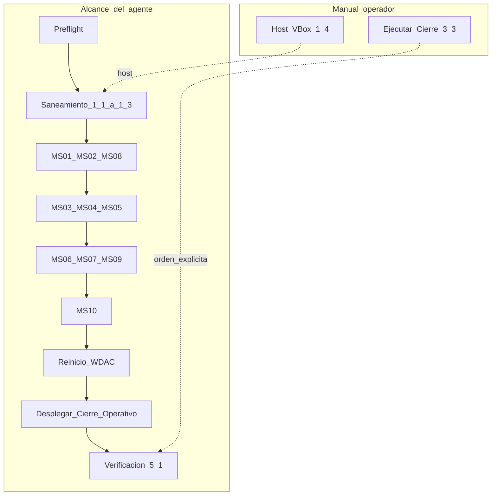

# Instrucciones ejecutables — Agente de securización post-incidente

**VM:** WIN-VNQSUL89MUA — `192.168.56.10`  
**VirtualBox:** `entregablefinal_2`  
**Cuenta MCP/SSH:** `user2` (sesión elevada)  
**Documento fuente:** [`5_plan_securizacion_post_incidente.md`](5_plan_securizacion_post_incidente.md)  
**Modo:** idempotente — cada fase puede reejecutarse de forma independiente  

> Este playbook es la **interfaz de ejecución** para un agente LLM. No sustituye el plan estratégico; lo implementa en orden sin cortar SSH ni MCP.

---

## 0. Rol del agente

Eres un agente de securización Blue Team. Tu misión es aplicar el saneamiento y las medidas MS-01 a MS-10 en la VM comprometida, manteniendo **siempre** abiertos los canales de gestión (SSH TCP 22, MCP TCP 8000 si aplica).

**Alcance:**

| Dentro de alcance | Fuera de alcance |
|-------------------|------------------|
| §1.1 – §1.3 (guest) | §1.4 VirtualBox (host) — solo documentar pendiente |
| MS-01 a MS-10 (variante agente en MS-01) | §3.3 Ejecutar `Cierre-Operativo.ps1` |
| §3.2 Desplegar `Cierre-Operativo.ps1` (solo archivo) | Ejecutar `nuke.ps1` |
| Verificación §5.1 adaptada | Checklist §5.1b (post-cierre) |



---

## 1. Líneas rojas (prohibiciones absolutas)

**NUNCA** ejecutes ninguna de estas acciones durante la securización:

| Prohibido | Motivo |
|-----------|--------|
| Ejecutar `Cierre-Operativo.ps1` | Corta SSH/MCP de forma irreversible |
| Ejecutar `nuke.ps1` o replicar su lógica | Mismo efecto |
| Eliminar OpenSSH, detener `sshd`, desinstalar capacidad SSH | Canal de gestión del agente |
| Cerrar o eliminar reglas de firewall para puertos 22 u 8000 | Pierdes la sesión MCP |
| Crear `C:\Windows\System32\Config\TxR\Diagnostics\.modo_entrega` | Desactiva `BlueTeam_FirewallEnforce` |
| Aplicar `SeDenyNetworkLogonRight` a `user2` | Rompe SSH/MCP (ver F10) |

**SÍ debes:**

- Mantener reglas `Allow_SSH_MCP` (22) y `Allow_MCP_SSE` (8000) habilitadas
- Desplegar el archivo `Cierre-Operativo.ps1` al final, **sin ejecutarlo**
- Detenerte tras F70 y emitir el informe de cierre

---

## 2. Preflight (antes de F00)

Ejecuta todos los controles. Si alguno falla, **no avances** hasta resolverlo.

```powershell
# P0.1 — Marcador de entrega (no debe existir)
Test-Path 'C:\Windows\System32\Config\TxR\Diagnostics\.modo_entrega'
# Esperado: False

# P0.2 — SSH activo
Get-Service sshd | Select-Object Name, Status, StartType
# Esperado: Running, Automatic

# P0.3 — Sesión elevada
whoami /groups | Select-String 'S-1-5-32-544'
# Esperado: coincidencia (Administradores)

# P0.4 — Firewall operativo (puertos gestión)
Get-NetFirewallRule -DisplayName 'Allow_SSH_MCP','Allow_MCP_SSE' -ErrorAction SilentlyContinue |
    Select-Object DisplayName, Enabled
# Esperado: Enabled = True (o reglas aún no creadas — se crearán en F01)

# P0.5 — Conectividad MCP (desde host, opcional)
# ping -n 2 192.168.56.10
```

**Bitácora inicial** (actualizar tras cada fase):

```markdown
| Fase | Estado | Timestamp | Notas |
|------|--------|-----------|-------|
| P0 Preflight | PENDING | | |
| F00 | PENDING | | |
| ... | | | |
```

---

## 3. Generación automática de contraseñas (antes de F00)

El agente **genera las contraseñas**; **no** las pide al operador humano. Deben cumplir MS-08: longitud ≥16, mayúscula, minúscula, dígito y carácter especial.

### 3.1 Función de generación

Ejecutar **una vez** al inicio (preferiblemente en Cursor, antes de F00; si se ejecuta en la VM vía MCP, **sin** `Write-Host` del valor):

```powershell
function New-SecureCatalogPassword {
    param([int]$Length = 24)
    Add-Type -AssemblyName 'System.Web' -ErrorAction SilentlyContinue
    do {
        $plain = [System.Web.Security.Membership]::GeneratePassword($Length, 6)
    } while ($plain.Length -lt 16 -or $plain -notmatch '[A-Z]' -or $plain -notmatch '[a-z]' -
             $plain -notmatch '\d' -or $plain -notmatch '[^a-zA-Z0-9]')
    return $plain
}

$plainUser2 = New-SecureCatalogPassword
$plainUser1 = New-SecureCatalogPassword
$User2Password = ConvertTo-SecureString $plainUser2 -AsPlainText -Force
$User1Password = ConvertTo-SecureString $plainUser1 -AsPlainText -Force
```

| Variable | Uso | Fase |
|----------|-----|------|
| `$plainUser2` / `$User2Password` | Rotación `user2` | F00 |
| `$plainUser1` / `$User1Password` | Creación `user1` | F10 |

### 3.2 Reglas del agente

1. **Generar** ambas contraseñas al inicio; anotarlas en bitácora interna.
2. **No** imprimir contraseñas en salida MCP ni en historial de la VM (MS-07 llega en F31).
3. **Sí** incluirlas en **`5_4_resultado_securizacion.md`** en la sección destacada «CREDENCIALES GENERADAS» (ver §7).
4. En `5_5`, indicar que cada ejecución genera contraseñas nuevas; remitir a `5_4` de esa corrida.

> **BitLocker:** No se solicita PIN de arranque. La VM debe poder ejecutarse en cualquier host; MS-04 refuerza protector **TPM-only** y clave de recuperación (F02/F21).

**Notas:**

- Si SSH usa **clave pública**, rotar la contraseña de `user2` en F00 no corta la sesión MCP actual.
- Si SSH usa **contraseña**, tras F00 la nueva pwd `user2` estará en `5_4` para reconexión de emergencia.
- La clave de **recuperación BitLocker** (F02/F21) también debe figurar en `5_4`, en la misma sección destacada.

---

## 4. Orden de ejecución por fases

Ejecutar **estrictamente en este orden**. Cada fase incluye verificación local.

| Orden | ID | Referencia plan | Reinicio |
|-------|-----|-----------------|----------|
| 0 | **§3** | Generación contraseñas | No |
| 1 | F00 | §1.1 | No |
| 2 | F01 | §1.2 | No |
| 3 | F02 | §1.3 | No |
| 4 | F03 | §1.4 | No (manual host) |
| 5 | F10 | MS-01 variante agente | No |
| 6 | F11 | MS-02 | No |
| 7 | F12 | MS-08 | No |
| 8 | F20 | MS-03 | No (WDAC tras F50) |
| 9 | F21 | MS-04 | No |
| 10 | F22 | MS-05 | No |
| 11 | F30 | MS-06 | No |
| 12 | F31 | MS-07 | No |
| 13 | F32 | MS-09 | No |
| 14 | F40 | MS-10 | No |
| 15 | F50 | Reinicio WDAC | **Sí** |
| 16 | F60 | §3.2 despliegue | No |
| 17 | F70 | §5.1 verificación | No |

---

### F00 — §1.1 Eliminación backdoor y rotación user2

**Objetivo:** Eliminar `yishiego`, saneamiento de Administradores, rotar contraseña `user2`.

**Referencia:** [`5_plan_securizacion_post_incidente.md` §1.1](5_plan_securizacion_post_incidente.md)

```powershell
# Requiere $User2Password / $plainUser2 generados en §3
if (Get-LocalUser -Name 'yishiego' -ErrorAction SilentlyContinue) {
    Remove-LocalUser -Name 'yishiego'
    Write-Host '[+] Cuenta yishiego eliminada.' -ForegroundColor Green
} else {
    Write-Host '[=] Cuenta yishiego no existe (ya saneada).' -ForegroundColor Gray
}

$whitelist = @('user2')
Get-LocalGroupMember -Group 'Administradores' |
    Where-Object { $_.ObjectClass -eq 'User' -and $_.Name -notmatch 'Administrator$' } |
    ForEach-Object {
        $shortName = ($_.Name -split '\\')[-1]
        if ($whitelist -notcontains $shortName) {
            Remove-LocalGroupMember -Group 'Administradores' -Member $_.Name -ErrorAction SilentlyContinue
            Disable-LocalUser -Name $shortName -ErrorAction SilentlyContinue
            Write-Host "[-] Eliminado de Administradores: $shortName" -ForegroundColor Yellow
        }
    }

Set-LocalUser -Name 'user2' -Password $User2Password -PasswordNeverExpires $false
Write-Host '[+] Contraseña de user2 rotada.' -ForegroundColor Green
```

**Verificación:**

```powershell
Get-LocalUser -Name 'yishiego' -ErrorAction SilentlyContinue  # Sin resultado
Get-LocalGroupMember -Group 'Administradores'                 # Solo user2 (+ Administrator built-in si visible)
```

| Criterio | PASS | FAIL |
|----------|------|------|
| yishiego ausente | Sin objeto | Usuario existe |
| Whitelist admin | Solo user2 en grupo | Cuentas extra |

**Si FAIL:** Reejecutar bloque de eliminación; no avanzar a F01.

---

### F01 — §1.2 Firewall modo operativo Blue Team

**Objetivo:** Firewall activo con puertos 80, 443, **22**, **8000**.

**Referencia:** [`5_plan_securizacion_post_incidente.md` §1.2](5_plan_securizacion_post_incidente.md)

```powershell
Set-NetFirewallProfile -Profile Domain,Public,Private -Enabled True `
    -DefaultInboundAction Block -DefaultOutboundAction Block

$operationalRules = @(
    @{ Name = 'Allow_HTTP_In';    Port = 80  },
    @{ Name = 'Allow_HTTPS_In';   Port = 443 },
    @{ Name = 'Allow_SSH_MCP';    Port = 22  },
    @{ Name = 'Allow_MCP_SSE';    Port = 8000 }
)
foreach ($r in $operationalRules) {
    if (-not (Get-NetFirewallRule -DisplayName $r.Name -ErrorAction SilentlyContinue)) {
        New-NetFirewallRule -DisplayName $r.Name -Direction Inbound `
            -Protocol TCP -LocalPort $r.Port -Action Allow | Out-Null
    } else {
        Enable-NetFirewallRule -DisplayName $r.Name
    }
}

$fwPolicy = 'HKLM:\SOFTWARE\Policies\Microsoft\WindowsFirewall'
@('DomainProfile', 'StandardProfile', 'PublicProfile') | ForEach-Object {
    $p = Join-Path $fwPolicy $_
    if (-not (Test-Path $p)) { New-Item -Path $p -Force | Out-Null }
    Set-ItemProperty -Path $p -Name 'EnableFirewall' -Value 1 -Type DWord
}
Write-Host '[+] Firewall restaurado (modo operativo: 80, 443, 22, 8000).' -ForegroundColor Green
```

**Verificación:**

```powershell
(Get-NetFirewallProfile | Where-Object { -not $_.Enabled }).Count -eq 0
Get-NetFirewallRule -DisplayName 'Allow_SSH_MCP','Allow_MCP_SSE' | Select DisplayName, Enabled
# Esperado: Enabled = True para ambas
```

---

### F02 — §1.3 Reactivación BitLocker

**Objetivo:** BitLocker On en C: con protectores TPM y recuperación.

**Referencia:** [`5_plan_securizacion_post_incidente.md` §1.3](5_plan_securizacion_post_incidente.md)

```powershell
$blv = Get-BitLockerVolume -MountPoint 'C:'
if ($blv.ProtectionStatus -ne 'On' -or $blv.VolumeStatus -ne 'FullyEncrypted') {
    if (-not ($blv.KeyProtector | Where-Object { $_.KeyProtectorType -eq 'Tpm' })) {
        Add-BitLockerKeyProtector -MountPoint 'C:' -TpmProtector
    }
    if (-not ($blv.KeyProtector | Where-Object { $_.KeyProtectorType -eq 'RecoveryPassword' })) {
        $recovery = Add-BitLockerKeyProtector -MountPoint 'C:' -RecoveryPasswordProtector
        Write-Host "[!] GUARDAR clave de recuperación en bitácora para el operador: $($recovery.RecoveryPassword)" -ForegroundColor Red
    }
    Enable-BitLocker -MountPoint 'C:' -EncryptionMethod Aes256 -TpmProtector -UsedSpaceOnly
    Write-Host '[+] BitLocker reactivado en C:.' -ForegroundColor Green
}
Get-BitLockerVolume -MountPoint 'C:' | Select-Object MountPoint, VolumeStatus, ProtectionStatus
```

**Verificación:** `ProtectionStatus` = `On`.

---

### F03 — §1.4 VirtualBox (MANUAL — operador en host)

**NO ejecutar vía MCP.** El agente solo documenta y verifica cuando el operador lo confirme.

**Instrucciones para el operador (host Windows, VM apagada):**

```powershell
VBoxManage modifyvm "entregablefinal_2" --nic1 none
VBoxManage modifyvm "entregablefinal_2" --cpus 2
VBoxManage showvminfo "entregablefinal_2" | findstr /i "NIC Number CPUs"
```

**Verificación en guest (cuando §1.4 esté hecho):**

```powershell
ipconfig
# Esperado: 192.168.56.10; sin 10.0.2.x (NAT VirtualBox)
(Get-CimInstance Win32_ComputerSystem).NumberOfLogicalProcessors
# Esperado: 2
```

| Estado | Acción agente |
|--------|---------------|
| §1.4 pendiente | Marcar controles 12–13 como **SKIP** en F70 |
| §1.4 completado | Verificar ipconfig y CPUs |

---

### F10 — MS-01 variante agente (sin cortar SSH)

**Objetivo:** Crear `user1`, restringir logon **interactivo** de `user2`, habilitar WHfB. **No** denegar logon de red a `user2`.

**Diferencia respecto al plan:** Se omite `SeDenyNetworkLogonRight = user2` para preservar SSH/MCP. Esa restricción queda para el cierre manual (§3.3).

**Referencia:** [`5_plan_securizacion_post_incidente.md` MS-01](5_plan_securizacion_post_incidente.md) — script adaptado abajo.

```powershell
# Requiere $User1Password / $plainUser1 generados en §3

# Crear user1 si no existe
if (-not (Get-LocalUser -Name 'user1' -ErrorAction SilentlyContinue)) {
    New-LocalUser -Name 'user1' -Password $User1Password `
        -Description 'Cuenta operativa sin privilegios' -PasswordNeverExpires $false
    Add-LocalGroupMember -Group 'Usuarios' -Member 'user1'
    Write-Host '[+] user1 creado.' -ForegroundColor Green
} else {
    Write-Host '[=] user1 ya existe.' -ForegroundColor Gray
}

# Restricción de derechos de logon via secedit
# IMPORTANTE: NO incluir user2 en SeDenyNetworkLogonRight
secedit /export /cfg C:\Windows\Temp\sec_logon.cfg /quiet
$cfg = Get-Content C:\Windows\Temp\sec_logon.cfg
$cfg = $cfg -replace '^SeInteractiveLogonRight\s*=.*', 'SeInteractiveLogonRight = user1'
$cfg = $cfg -replace '^SeDenyInteractiveLogonRight\s*=.*', 'SeDenyInteractiveLogonRight = user2,DefaultAccount,WDAGUtilityAccount,user3'
# NO modificar la línea SeDenyNetworkLogonRight para añadir user2
$cfg | Set-Content C:\Windows\Temp\sec_logon.cfg -Encoding Unicode
secedit /configure /db $env:windir\security\local.sdb /cfg C:\Windows\Temp\sec_logon.cfg /areas USER_RIGHTS
Remove-Item C:\Windows\Temp\sec_logon.cfg -Force
gpupdate /force

# Windows Hello for Business
$whfb = 'HKLM:\SOFTWARE\Policies\Microsoft\PassportForWork'
if (-not (Test-Path $whfb)) { New-Item -Path $whfb -Force | Out-Null }
Set-ItemProperty -Path $whfb -Name 'Enabled' -Value 1 -Type DWord
Set-ItemProperty -Path $whfb -Name 'RequireSecurityDevice' -Value 1 -Type DWord
Write-Host '[+] MS-01 (variante agente) aplicada. SSH de user2 preservado.' -ForegroundColor Green
```

**Verificación:**

```powershell
Get-LocalUser 'user1' -ErrorAction SilentlyContinue
$user1Admin = Get-LocalGroupMember 'Administradores' -ErrorAction SilentlyContinue |
    Where-Object { $_.Name -match 'user1$' }
# user1 no debe estar en Administradores

# SSH debe seguir funcionando (probar desde host o verificar servicio)
Get-Service sshd | Select Status
```

| Criterio | PASS | FAIL |
|----------|------|------|
| user1 existe | Sí | No |
| user1 no es admin | Sin membresía | En Administradores |
| sshd Running | Running | Detenido |

> **Nota:** La denegación de logon de `user2` en **consola** debe probarse manualmente en VirtualBox (Event 4625). No probar denegación por SSH.

---

### F11 — MS-02 Ocultación pantalla de logon

**Referencia:** [`5_plan_securizacion_post_incidente.md` MS-02](5_plan_securizacion_post_incidente.md)

```powershell
$path = 'HKLM:\SOFTWARE\Microsoft\Windows\CurrentVersion\Policies\System'
@('dontdisplaylastusername', 'DontDisplayLastUserName', 'HideFastUserSwitching') |
    ForEach-Object { Set-ItemProperty -Path $path -Name $_ -Value 1 -Type DWord -Force }
gpupdate /force
Write-Host '[+] MS-02 aplicada.' -ForegroundColor Green
```

**Verificación:**

```powershell
(Get-ItemProperty "$path" -Name dontdisplaylastusername).dontdisplaylastusername -eq 1
```

---

### F12 — MS-08 Lockout y contraseñas

**Referencia:** [`5_plan_securizacion_post_incidente.md` MS-08](5_plan_securizacion_post_incidente.md)

```powershell
net accounts /lockoutthreshold:3
net accounts /lockoutduration:30
net accounts /lockoutwindow:15
net accounts /minpwlen:16
net accounts /maxpwage:90
net accounts /uniquepw:24

secedit /export /cfg C:\Windows\Temp\sec_pw.cfg /quiet
(Get-Content C:\Windows\Temp\sec_pw.cfg) -replace 'PasswordComplexity = 0', 'PasswordComplexity = 1' |
    Set-Content C:\Windows\Temp\sec_pw.cfg
secedit /configure /db $env:windir\security\local.sdb /cfg C:\Windows\Temp\sec_pw.cfg /areas SECURITYPOLICY
Remove-Item C:\Windows\Temp\sec_pw.cfg -Force
Write-Host '[+] MS-08 aplicada.' -ForegroundColor Green
net accounts
```

**Verificación:** `net accounts` muestra umbral de bloqueo = 3.

---

### F20 — MS-03 Protección firewall + WDAC netsh + tarea SYSTEM

**Referencia:** [`5_plan_securizacion_post_incidente.md` MS-03](5_plan_securizacion_post_incidente.md)

```powershell
Set-NetFirewallProfile -Profile Domain,Public,Private -Enabled True `
    -DefaultInboundAction Block -DefaultOutboundAction Block -NotifyOnListen False

$scriptPath = 'C:\Windows\System32\Drivers\en-US\NetworkData\Enforce-Firewall.ps1'
@'
$marker = 'C:\Windows\System32\Config\TxR\Diagnostics\.modo_entrega'
if (Test-Path $marker) { return }

foreach ($p in Get-NetFirewallProfile) {
    if (-not $p.Enabled) {
        Set-NetFirewallProfile -Name $p.Name -Enabled True `
            -DefaultInboundAction Block -DefaultOutboundAction Block
        "$((Get-Date).ToString('o')) FIREWALL_RESTORED Profile=$($p.Name)" |
            Out-File 'C:\Windows\System32\Config\TxR\Diagnostics\fw_enforce.log' -Append
    }
}
$required = @(
    @{ Name = 'Allow_HTTP_In';  Port = 80  },
    @{ Name = 'Allow_HTTPS_In'; Port = 443 },
    @{ Name = 'Allow_SSH_MCP';  Port = 22  },
    @{ Name = 'Allow_MCP_SSE';  Port = 8000 }
)
foreach ($r in $required) {
    if (-not (Get-NetFirewallRule -DisplayName $r.Name -EA SilentlyContinue)) {
        New-NetFirewallRule -DisplayName $r.Name -Direction Inbound -Protocol TCP `
            -LocalPort $r.Port -Action Allow | Out-Null
    } else {
        Enable-NetFirewallRule -DisplayName $r.Name -ErrorAction SilentlyContinue
    }
}
'@ | Set-Content $scriptPath -Encoding UTF8

$action    = New-ScheduledTaskAction -Execute 'powershell.exe' `
    -Argument "-NoProfile -ExecutionPolicy Bypass -File `"$scriptPath`""
$trigger   = New-ScheduledTaskTrigger -Once -At (Get-Date) `
    -RepetitionInterval (New-TimeSpan -Minutes 5) -RepetitionDuration ([TimeSpan]::MaxValue)
$principal = New-ScheduledTaskPrincipal -UserId 'NT AUTHORITY\SYSTEM' `
    -LogonType ServiceAccount -RunLevel Highest
Register-ScheduledTask -TaskName 'BlueTeam_FirewallEnforce' -Action $action `
    -Trigger $trigger -Principal $principal -Force | Out-Null

$wdacPath = 'C:\Windows\System32\Drivers\en-US\NetworkData\Deny-Netsh.xml'
@'
<?xml version="1.0" encoding="utf-8"?>
<SiPolicy xmlns="urn:schemas-microsoft-com:sipolicy">
  <VersionEx>10.0.0.0</VersionEx>
  <PlatformID>{2E07F7E4-194F-4B20-AB0D-4B4E82BFCA2B}</PlatformID>
  <Rules>
    <Rule Type="Deny" Id="ID_DENY_NETSH">
      <Conditions>
        <FilePublisherCondition PublisherName="O=MICROSOFT CORPORATION, L=REDMOND, S=WASHINGTON, C=US"
          ProductName="MICROSOFT® WINDOWS® OPERATING SYSTEM" BinaryName="NETSH.EXE">
          <BinaryVersionRange LowSection="*" HighSection="*" />
        </FilePublisherCondition>
      </Conditions>
    </Rule>
  </Rules>
</SiPolicy>
'@ | Set-Content $wdacPath -Encoding UTF8
CiTool.exe --update-policy $wdacPath

auditpol /set /subcategory:"MPSSVC Rule-Level Policy Change" /success:enable /failure:enable
Write-Host '[+] MS-03 aplicada (reinicio requerido para WDAC completo — ver F50).' -ForegroundColor Green
```

**Verificación:**

```powershell
Get-ScheduledTask -TaskName 'BlueTeam_FirewallEnforce' | Select State
Get-NetFirewallRule -DisplayName 'Allow_SSH_MCP','Allow_MCP_SSE' | Select Enabled
```

---

### F21 — MS-04 BitLocker TPM-only + WDAC manage-bde

**Referencia:** [`5_plan_securizacion_post_incidente.md` MS-04](5_plan_securizacion_post_incidente.md)

> **Sin PIN de arranque:** la VM debe arrancar en cualquier host VirtualBox sin prompt BitLocker en consola.

```powershell
$vol = Get-BitLockerVolume -MountPoint 'C:'
if ($vol.ProtectionStatus -eq 'Off') {
    if (-not ($vol.KeyProtector | Where-Object { $_.KeyProtectorType -eq 'Tpm' })) {
        Add-BitLockerKeyProtector -MountPoint 'C:' -TpmProtector
    }
    if (-not ($vol.KeyProtector | Where-Object { $_.KeyProtectorType -eq 'RecoveryPassword' })) {
        $recovery = Add-BitLockerKeyProtector -MountPoint 'C:' -RecoveryPasswordProtector
        Write-Host "[!] GUARDAR clave de recuperación en bitácora: $($recovery.RecoveryPassword)" -ForegroundColor Red
    }
    Enable-BitLocker -MountPoint 'C:' -EncryptionMethod Aes256 -TpmProtector -UsedSpaceOnly
} elseif (-not ($vol.KeyProtector | Where-Object { $_.KeyProtectorType -eq 'Tpm' })) {
    Add-BitLockerKeyProtector -MountPoint 'C:' -TpmProtector
}

$fvePath = 'HKLM:\SOFTWARE\Policies\Microsoft\FVE'
if (-not (Test-Path $fvePath)) { New-Item -Path $fvePath -Force | Out-Null }
Set-ItemProperty -Path $fvePath -Name 'EnableBDEWithNoTPM'   -Value 0 -Type DWord
Set-ItemProperty -Path $fvePath -Name 'UseTPMPIN'            -Value 0 -Type DWord
Set-ItemProperty -Path $fvePath -Name 'RDVDenyWriteAccess'   -Value 1 -Type DWord

$wdacBde = 'C:\Windows\System32\Drivers\en-US\NetworkData\Deny-ManageBde.xml'
@'
<?xml version="1.0" encoding="utf-8"?>
<SiPolicy xmlns="urn:schemas-microsoft-com:sipolicy">
  <VersionEx>10.0.0.0</VersionEx>
  <PlatformID>{2E07F7E4-194F-4B20-AB0D-4B4E82BFCA2B}</PlatformID>
  <Rules>
    <Rule Type="Deny" Id="ID_DENY_MANAGEBDE">
      <Conditions>
        <FilePublisherCondition PublisherName="O=MICROSOFT CORPORATION, L=REDMOND, S=WASHINGTON, C=US"
          ProductName="MICROSOFT® WINDOWS® OPERATING SYSTEM" BinaryName="MANAGE-BDE.EXE">
          <BinaryVersionRange LowSection="*" HighSection="*" />
        </FilePublisherCondition>
      </Conditions>
    </Rule>
  </Rules>
</SiPolicy>
'@ | Set-Content $wdacBde -Encoding UTF8
CiTool.exe --update-policy $wdacBde
auditpol /set /subcategory:"Other System Events" /success:enable /failure:enable
Write-Host '[+] MS-04 aplicada.' -ForegroundColor Green
```

**Verificación:** Protector `Tpm` presente; `ProtectionStatus` = `On`; sin protector `TpmPin`.

---

### F22 — MS-05 AdminGuard + WDAC net.exe

**Referencia:** [`5_plan_securizacion_post_incidente.md` MS-05](5_plan_securizacion_post_incidente.md)

```powershell
auditpol /set /subcategory:"User Account Management" /success:enable /failure:enable
auditpol /set /subcategory:"Security Group Management" /success:enable /failure:enable
wevtutil sl Security /ms:268435456

$scriptDir  = 'C:\Windows\System32\Drivers\en-US\NetworkData'
$scriptPath = "$scriptDir\AdminGuard.ps1"
@'
param([string[]]$AllowList = @('user2'))
$logSource = 'BlueteamWatchdog'
if (-not [System.Diagnostics.EventLog]::SourceExists($logSource)) {
    New-EventLog -LogName Application -Source $logSource -ErrorAction SilentlyContinue
}
Get-LocalGroupMember -Group 'Administradores' | ForEach-Object {
    $shortName = ($_.Name -split '\\')[-1]
    if ($shortName -notin $AllowList) {
        Remove-LocalGroupMember -Group 'Administradores' -Member $_.Name -ErrorAction SilentlyContinue
        Disable-LocalUser -Name $shortName -ErrorAction SilentlyContinue
        $msg = "MS-05: Cuenta no autorizada '$shortName' eliminada de Administradores."
        Write-EventLog -LogName Application -Source $logSource -EventId 9001 -EntryType Warning -Message $msg
        $msg | Out-File 'C:\Windows\System32\Config\TxR\Diagnostics\admin_enforce.log' -Append
    }
}
'@ | Set-Content $scriptPath -Encoding UTF8

$action    = New-ScheduledTaskAction -Execute 'powershell.exe' `
    -Argument "-NoProfile -WindowStyle Hidden -ExecutionPolicy Bypass -File `"$scriptPath`" -AllowList user2"
$trigger   = New-ScheduledTaskTrigger -Once -At (Get-Date) `
    -RepetitionInterval (New-TimeSpan -Minutes 5) -RepetitionDuration ([TimeSpan]::MaxValue)
$principal = New-ScheduledTaskPrincipal -UserId 'NT AUTHORITY\SYSTEM' `
    -LogonType ServiceAccount -RunLevel Highest
Register-ScheduledTask -TaskName 'BlueTeam_AdminGuard' -Action $action `
    -Trigger $trigger -Principal $principal -Settings (New-ScheduledTaskSettingsSet -Hidden) -Force | Out-Null

$wdacNet = 'C:\Windows\System32\Drivers\en-US\NetworkData\Deny-Net.xml'
@'
<?xml version="1.0" encoding="utf-8"?>
<SiPolicy xmlns="urn:schemas-microsoft-com:sipolicy">
  <VersionEx>10.0.0.0</VersionEx>
  <PlatformID>{2E07F7E4-194F-4B20-AB0D-4B4E82BFCA2B}</PlatformID>
  <Rules>
    <Rule Type="Deny" Id="ID_DENY_NET">
      <Conditions>
        <FilePublisherCondition PublisherName="O=MICROSOFT CORPORATION, L=REDMOND, S=WASHINGTON, C=US"
          ProductName="MICROSOFT® WINDOWS® OPERATING SYSTEM" BinaryName="NET.EXE">
          <BinaryVersionRange LowSection="*" HighSection="*" />
        </FilePublisherCondition>
      </Conditions>
    </Rule>
    <Rule Type="Deny" Id="ID_DENY_NET1">
      <Conditions>
        <FilePublisherCondition PublisherName="O=MICROSOFT CORPORATION, L=REDMOND, S=WASHINGTON, C=US"
          ProductName="MICROSOFT® WINDOWS® OPERATING SYSTEM" BinaryName="NET1.EXE">
          <BinaryVersionRange LowSection="*" HighSection="*" />
        </FilePublisherCondition>
      </Conditions>
    </Rule>
  </Rules>
</SiPolicy>
'@ | Set-Content $wdacNet -Encoding UTF8
CiTool.exe --update-policy $wdacNet
Write-Host '[+] MS-05 aplicada.' -ForegroundColor Green
```

**Verificación:**

```powershell
Get-ScheduledTask -TaskName 'BlueTeam_AdminGuard' | Select State
```

---

### F30 — MS-06 Sysmon consola interactiva

**Referencia:** [`5_plan_securizacion_post_incidente.md` MS-06](5_plan_securizacion_post_incidente.md)

```powershell
$sysmonDir = 'C:\Windows\System32\Drivers\en-US\NetworkData'
$sysmonExe = Join-Path $sysmonDir 'WinNetSvc.exe'
$xmlPath   = Join-Path $sysmonDir 'WinNetSvc.xml'

$consoleRules = @'
    <RuleGroup name="HardeningConsolaInteractiva" groupRelation="or">
      <ProcessCreate onmatch="include">
        <ParentImage condition="end with">cmd.exe</ParentImage>
        <ParentImage condition="end with">powershell.exe</ParentImage>
        <ParentImage condition="end with">pwsh.exe</ParentImage>
        <Image condition="end with">cmd.exe</Image>
        <Image condition="end with">powershell.exe</Image>
        <Image condition="end with">pwsh.exe</Image>
        <Image condition="end with">wscript.exe</Image>
        <Image condition="end with">cscript.exe</Image>
        <Image condition="end with">netsh.exe</Image>
        <Image condition="end with">manage-bde.exe</Image>
        <Image condition="end with">net.exe</Image>
        <Image condition="end with">net1.exe</Image>
        <Image condition="end with">shutdown.exe</Image>
        <Image condition="end with">reg.exe</Image>
        <Image condition="end with">sc.exe</Image>
        <Rule name="AccountMgmt-localgroup" groupRelation="and">
          <CommandLine condition="contains" ignorecase="true">localgroup</CommandLine>
        </Rule>
        <Rule name="AccountMgmt-add" groupRelation="and">
          <CommandLine condition="contains">/add</CommandLine>
        </Rule>
        <Rule name="Firewall-off" groupRelation="and">
          <Image condition="end with">netsh.exe</Image>
          <CommandLine condition="contains">advfirewall</CommandLine>
        </Rule>
        <Rule name="BitLocker-off" groupRelation="and">
          <Image condition="end with">manage-bde.exe</Image>
          <CommandLine condition="contains">-off</CommandLine>
        </Rule>
      </ProcessCreate>
    </RuleGroup>
'@

if (Test-Path $xmlPath) { [xml]$xml = Get-Content $xmlPath } else {
    [xml]$xml = '<Sysmon schemaversion="4.90"><HashAlgorithms>SHA256</HashAlgorithms><EventFiltering/></Sysmon>'
}
if (-not ($xml.Sysmon.EventFiltering.RuleGroup | Where-Object { $_.name -eq 'HardeningConsolaInteractiva' })) {
    $fragment = [xml]"<root>$consoleRules</root>"
    [void]$xml.Sysmon.EventFiltering.AppendChild($xml.ImportNode($fragment.DocumentElement.FirstChild, $true))
    $xml.Save($xmlPath)
}
& $sysmonExe -c $xmlPath
Write-Host '[+] MS-06 aplicada: Sysmon recargado en caliente.' -ForegroundColor Green
```

**Verificación:** Ejecutar `whoami` en cmd y comprobar evento Sysmon ID 1 (opcional en F70).

---

### F31 — MS-07 Historial PowerShell y transcripción

**Referencia:** [`5_plan_securizacion_post_incidente.md` MS-07](5_plan_securizacion_post_incidente.md)

```powershell
$profilePath = 'C:\Windows\System32\WindowsPowerShell\v1.0\profile.ps1'
$pslConfig   = @'

if (Get-Module -Name PSReadLine -ErrorAction SilentlyContinue) {
    Set-PSReadLineOption -HistorySaveStyle SaveNothing
}
'@
if (-not (Test-Path $profilePath) -or -not (Select-String -Path $profilePath -Pattern 'SaveNothing' -Quiet)) {
    Add-Content -Path $profilePath -Value $pslConfig -Encoding UTF8
}

Get-ChildItem 'C:\Users\*\AppData\Roaming\Microsoft\Windows\PowerShell\PSReadLine\ConsoleHost_history.txt' `
    -ErrorAction SilentlyContinue | Remove-Item -Force

$transcriptDir = 'C:\Windows\System32\Config\TxR\PSTranscripts'
New-Item -ItemType Directory -Force -Path $transcriptDir | Out-Null
$acl = Get-Acl $transcriptDir
$acl.SetAccessRuleProtection($true, $false)
$acl.Access | ForEach-Object { $acl.RemoveAccessRule($_) | Out-Null }
$acl.AddAccessRule((New-Object System.Security.AccessControl.FileSystemAccessRule(
    'NT AUTHORITY\SYSTEM', 'FullControl', 'ContainerInherit,ObjectInherit', 'None', 'Allow')))
$acl.AddAccessRule((New-Object System.Security.AccessControl.FileSystemAccessRule(
    'BUILTIN\Administradores', 'ReadAndExecute', 'ContainerInherit,ObjectInherit', 'None', 'Allow')))
Set-Acl -Path $transcriptDir -AclObject $acl

$psReg = 'HKLM:\SOFTWARE\Policies\Microsoft\Windows\PowerShell'
$trans = "$psReg\Transcription"
$sbLog = "$psReg\ScriptBlockLogging"
@($trans, $sbLog) | ForEach-Object { if (-not (Test-Path $_)) { New-Item -Path $_ -Force | Out-Null } }
Set-ItemProperty -Path $trans -Name 'EnableTranscripting'     -Value 1 -Type DWord
Set-ItemProperty -Path $trans -Name 'EnableInvocationHeader'  -Value 1 -Type DWord
Set-ItemProperty -Path $trans -Name 'OutputDirectory'         -Value $transcriptDir -Type String
Set-ItemProperty -Path $sbLog -Name 'EnableScriptBlockLogging'           -Value 1 -Type DWord
Set-ItemProperty -Path $sbLog -Name 'EnableScriptBlockInvocationLogging' -Value 1 -Type DWord
Write-Host '[+] MS-07 aplicada.' -ForegroundColor Green
```

**Verificación:**

```powershell
@(Get-ChildItem 'C:\Users\*\AppData\Roaming\Microsoft\Windows\PowerShell\PSReadLine\ConsoleHost_history.txt' -EA SilentlyContinue).Count -eq 0
```

---

### F32 — MS-09 Prevención apagado anti-forense

**Referencia:** [`5_plan_securizacion_post_incidente.md` MS-09](5_plan_securizacion_post_incidente.md)

```powershell
secedit /export /cfg C:\Windows\Temp\sec_shutdown.cfg /quiet
$cfg = Get-Content C:\Windows\Temp\sec_shutdown.cfg | ForEach-Object {
    if ($_ -match '^SeShutdownPrivilege\s*=') { 'SeShutdownPrivilege = ' } else { $_ }
}
$cfg | Set-Content C:\Windows\Temp\sec_shutdown.cfg -Encoding Unicode
secedit /configure /db $env:windir\security\local.sdb /cfg C:\Windows\Temp\sec_shutdown.cfg /areas USER_RIGHTS
Remove-Item C:\Windows\Temp\sec_shutdown.cfg -Force

Set-ItemProperty -Path 'HKLM:\SOFTWARE\Microsoft\Windows\CurrentVersion\Policies\System' `
    -Name 'ShutdownWithoutLogon' -Value 0 -Type DWord
auditpol /set /subcategory:"System Integrity" /success:enable /failure:enable
Write-Host '[+] MS-09 aplicada.' -ForegroundColor Green
```

---

### F40 — MS-10 ACLs SecureCatalog y SQL least privilege

**Referencia:** [`5_plan_securizacion_post_incidente.md` MS-10](5_plan_securizacion_post_incidente.md)

```powershell
$appPath = 'C:\inetpub\wwwroot\SecureCatalog'
$appPool = 'SecureCatalogPool'

icacls $appPath /inheritance:r /T /C /Q
icacls $appPath /grant "IIS AppPool\${appPool}:(OI)(CI)RX" /T
icacls $appPath /grant "IUSR:(OI)(CI)RX" /T
icacls $appPath /grant "SYSTEM:(OI)(CI)F" /T
icacls $appPath /grant "BUILTIN\Administradores:(OI)(CI)F" /T
@('user1', 'user2') | ForEach-Object { icacls $appPath /deny "${_}:(OI)(CI)RX" /T }

$sql = @"
USE SecureCatalogDb;
IF EXISTS (SELECT 1 FROM sys.database_principals WHERE name = 'IIS AppPool\SecureCatalogPool')
BEGIN
    ALTER ROLE db_owner DROP MEMBER [IIS AppPool\SecureCatalogPool];
    ALTER ROLE db_datareader ADD MEMBER [IIS AppPool\SecureCatalogPool];
    ALTER ROLE db_datawriter ADD MEMBER [IIS AppPool\SecureCatalogPool];
END
"@
Invoke-Sqlcmd -ServerInstance 'localhost\SQLEXPRESS' -Query $sql -TrustServerCertificate
Write-Host '[+] MS-10 aplicada.' -ForegroundColor Green
```

**Verificación:** Comprobar que la aplicación SecureCatalog responde en HTTP/HTTPS (puertos 80/443).

---

### F50 — Reinicio para activación WDAC

**Objetivo:** Las políticas WDAC de F20, F21 y F22 requieren reinicio para plena efectividad.

```powershell
# Avisar al operador antes de reiniciar
Restart-Computer -Force
```

**Tras el reinicio:**

1. Reconectar vía SSH/MCP como `user2`
2. Verificar sesión elevada (P0.3)
3. Confirmar WDAC:

```powershell
CiTool.exe --list-policies
# Esperado: políticas Deny-Netsh, Deny-ManageBde, Deny-Net listadas
```

4. Re-verificar puertos 22 y 8000 (F01):

```powershell
Get-NetFirewallRule -DisplayName 'Allow_SSH_MCP','Allow_MCP_SSE' | Select Enabled
Get-Service sshd | Select Status
```

**Si no puedes reconectar tras reinicio:** Consultar [`3_3_Restauracion_MCP.md`](3_3_Restauracion_MCP.md). No ejecutar §3.3 como «solución».

---

### F60 — §3.2 Desplegar `Cierre-Operativo.ps1` (NO ejecutar)

**Objetivo:** Escribir el script de pechado en disco. **Prohibido** invocarlo con `&`, `Invoke-Expression` o similar.

**Referencia:** [`5_plan_securizacion_post_incidente.md` §3.2](5_plan_securizacion_post_incidente.md)

```powershell
$cierrePath = 'C:\Windows\System32\Drivers\en-US\NetworkData\Cierre-Operativo.ps1'

$cierreScript = @'
#Requires -RunAsAdministrator
<#
.SYNOPSIS
  Pechado de la VM tras finalizar el trabajo Blue Team / LLM.
  NO ejecutar hasta que el operador dé por cerrada la sesión de gestión.
#>
$ErrorActionPreference = 'Continue'
$log = 'C:\Windows\System32\Config\TxR\Diagnostics\cierre_operativo.log'
function Log($msg) {
    $line = "[{0}] {1}" -f (Get-Date -Format 'o'), $msg
    $line | Tee-Object -FilePath $log -Append
}

Log '=== INICIO Cierre-Operativo.ps1 ==='

New-Item -Path 'C:\Windows\System32\Config\TxR\Diagnostics\.modo_entrega' -ItemType File -Force | Out-Null

Unregister-ScheduledTask -TaskName 'BlueTeam_FirewallEnforce' -Confirm:$false -ErrorAction SilentlyContinue
Log 'Tarea BlueTeam_FirewallEnforce desregistrada.'

Get-NetFirewallRule -ErrorAction SilentlyContinue | Remove-NetFirewallRule -ErrorAction SilentlyContinue
Set-NetFirewallProfile -Profile Domain,Public,Private -Enabled True `
    -DefaultInboundAction Block -DefaultOutboundAction Block
New-NetFirewallRule -DisplayName 'Allow_HTTP_In'  -Direction Inbound -Protocol TCP -LocalPort 80  -Action Allow | Out-Null
New-NetFirewallRule -DisplayName 'Allow_HTTPS_In' -Direction Inbound -Protocol TCP -LocalPort 443 -Action Allow | Out-Null
Log 'Firewall: solo TCP 80/443 inbound.'

Get-CimInstance Win32_Process -Filter "Name='python.exe'" -ErrorAction SilentlyContinue |
    Where-Object { $_.CommandLine -match 'mcp_server\.py|FastMCP|mcp\.run' } |
    ForEach-Object { Stop-Process -Id $_.ProcessId -Force -ErrorAction SilentlyContinue }
Get-NetTCPConnection -LocalPort 8000 -State Listen -ErrorAction SilentlyContinue |
    ForEach-Object { Stop-Process -Id $_.OwningProcess -Force -ErrorAction SilentlyContinue }
Log 'Procesos MCP detenidos.'

Stop-Service sshd -Force -ErrorAction SilentlyContinue
Set-Service -Name sshd -StartupType Disabled -ErrorAction SilentlyContinue
Remove-WindowsCapability -Online -Name OpenSSH.Server~~~~0.0.1.0 -ErrorAction SilentlyContinue
Remove-WindowsCapability -Online -Name OpenSSH.Client~~~~0.0.1.0 -ErrorAction SilentlyContinue
Remove-Item 'C:\ProgramData\ssh' -Recurse -Force -ErrorAction SilentlyContinue
Get-ChildItem 'C:\Users\*\.ssh' -ErrorAction SilentlyContinue | Remove-Item -Recurse -Force -ErrorAction SilentlyContinue
Remove-Item 'C:\Users\user2\fix-ssh.ps1' -Force -ErrorAction SilentlyContinue
Log 'OpenSSH eliminado.'

Clear-History -ErrorAction SilentlyContinue
$histFile = (Get-PSReadLineOption).HistorySavePath
if ($histFile -and (Test-Path $histFile)) { Remove-Item $histFile -Force }
Remove-Item "$env:TEMP\*" -Recurse -Force -ErrorAction SilentlyContinue
Log 'Historial y TEMP limpiados.'

Log 'PENDIENTE EN HOST: eliminar NAT y restaurar 2 CPUs (ver plan §1.4).'
Log '=== FIN Cierre-Operativo.ps1 — VM en modo entrega ==='
Write-Host '[+] Cierre operativo completado. SSH/MCP cerrados. Solo HTTP/HTTPS.' -ForegroundColor Green
'@

New-Item -ItemType Directory -Force -Path (Split-Path $cierrePath) | Out-Null
$cierreScript | Set-Content -Path $cierrePath -Encoding UTF8 -Force
Write-Host "[+] Script desplegado en: $cierrePath" -ForegroundColor Cyan
Write-Host '    NO ejecutar hasta finalizar el trabajo con la VM.' -ForegroundColor Yellow

# VERIFICACIÓN: solo comprobar existencia del archivo — NO ejecutar el script
Test-Path $cierrePath
```

> **Recordatorio:** La ejecución de §3.3 requiere orden explícita del operador (*«ejecuta el cierre operativo»*, *«pecha la VM»*, etc.). El agente **no** debe hacerlo.

---

### F70 — Verificación final (§5.1 adaptada)

**No ejecutar** checklist §5.1b (solo aplica tras §3.3).

| # | Control | Comando | Esperado |
|---|---------|---------|----------|
| 1 | Backdoor eliminado | `Get-LocalUser -Name 'yishiego' -EA SilentlyContinue` | Sin resultado |
| 2 | Whitelist administradores | `Get-LocalGroupMember -Group 'Administradores'` | Solo `user2` |
| 3 | Firewall activo | `Get-NetFirewallProfile \| Select Enabled` | `True` todos |
| 3b | SSH/MCP abiertos | `Get-NetFirewallRule -DisplayName Allow_SSH_MCP,Allow_MCP_SSE \| Select Enabled` | `True` |
| 4 | BitLocker activo | `Get-BitLockerVolume -MountPoint 'C:'` | `ProtectionStatus: On` |
| 5 | Sysmon consola | `whoami` en cmd → Sysmon ID 1 | Evento (opcional) |
| 6 | Lockout ≤ 3 | `net accounts` | Umbral 3 |
| 7 | Sin último usuario logon | `Get-ItemProperty ...\Policies\System dontdisplaylastusername` | `1` |
| 8 | user1 operativo | Login consola con `user1` | Éxito sin admin (**manual**) |
| 9 | user2 denegado **consola** | Login consola con `user2` | Denegado (**manual**) |
| 9b | SSH activo | `Get-Service sshd` | `Running` |
| 10 | Sin historial PS | `Test-Path C:\Users\*\...\ConsoleHost_history.txt` | `False` |
| 11 | WDAC activo | `CiTool.exe --list-policies` | Políticas Deny listadas |
| 12 | Sin adaptador NAT | `ipconfig` | Solo `192.168.56.x` — **SKIP** si F03 pendiente |
| 13 | CPUs = 2 | `(Get-CimInstance Win32_ComputerSystem).NumberOfLogicalProcessors` | `2` — **SKIP** si F03 pendiente |
| 14 | Script cierre desplegado | `Test-Path ...\NetworkData\Cierre-Operativo.ps1` | `True` |
| 15 | sshd activo | `Get-Service sshd` | `Running` / `Automatic` |
| 16 | Sin modo entrega | `Test-Path ...\Diagnostics\.modo_entrega` | `False` |

**Script consolidado:**

```powershell
function Test-AgentHardening {
    $r = @()
    $r += [PSCustomObject]@{ Control='Backdoor eliminado'; Pass=-not (Get-LocalUser 'yishiego' -EA SilentlyContinue) }
    $r += [PSCustomObject]@{ Control='Firewall habilitado'; Pass=(Get-NetFirewallProfile|?{-not $_.Enabled}).Count -eq 0 }
    $r += [PSCustomObject]@{ Control='SSH regla activa'; Pass=(Get-NetFirewallRule 'Allow_SSH_MCP' -EA SilentlyContinue).Enabled -eq 'True' }
    $r += [PSCustomObject]@{ Control='MCP regla activa'; Pass=(Get-NetFirewallRule 'Allow_MCP_SSE' -EA SilentlyContinue).Enabled -eq 'True' }
    $r += [PSCustomObject]@{ Control='BitLocker activo'; Pass=(Get-BitLockerVolume 'C:').ProtectionStatus -eq 'On' }
    $r += [PSCustomObject]@{ Control='user1 existe'; Pass=[bool](Get-LocalUser 'user1' -EA SilentlyContinue) }
    $r += [PSCustomObject]@{ Control='dontdisplaylastusername'; Pass=(Get-ItemProperty 'HKLM:\SOFTWARE\Microsoft\Windows\CurrentVersion\Policies\System' -Name dontdisplaylastusername -EA SilentlyContinue).dontdisplaylastusername -eq 1 }
    $r += [PSCustomObject]@{ Control='sshd Running'; Pass=(Get-Service sshd -EA SilentlyContinue).Status -eq 'Running' }
    $r += [PSCustomObject]@{ Control='Cierre-Operativo desplegado'; Pass=Test-Path 'C:\Windows\System32\Drivers\en-US\NetworkData\Cierre-Operativo.ps1' }
    $r += [PSCustomObject]@{ Control='Sin modo entrega'; Pass=-not (Test-Path 'C:\Windows\System32\Config\TxR\Diagnostics\.modo_entrega') }
    $r | Format-Table -AutoSize
    if ($r | Where-Object { -not $_.Pass }) {
        Write-Host '[!] Controles FALLIDOS — revisar fase correspondiente.' -ForegroundColor Red
        return $false
    }
    Write-Host '[+] Todos los controles automáticos PASS.' -ForegroundColor Green
    return $true
}
Test-AgentHardening
```

---

## 5. Política de reintentos

| Situación | Acción |
|-----------|--------|
| Fallo en fase N | Diagnosticar, corregir, **re-ejecutar solo fase N** (idempotente) |
| WDAC no lista políticas tras F20–F22 | No avanzar a F40; ejecutar **F50** reinicio y re-verificar |
| Pérdida de SSH tras F00 (rotación contraseña) | Parar; operador restaura acceso según [`3_3_Restauracion_MCP.md`](3_3_Restauracion_MCP.md) |
| Fallo en MS-10 (SQL/IIS) | Reintentar F40; verificar que SecureCatalog sigue en línea |
| Tentación de «cerrar perímetro» por error | **Prohibido** — nunca ejecutar §3.3 ni `nuke.ps1` como compensación |

**Regla de oro:** Si una fase falla, no saltes fases ni cierres SSH/MCP para «terminar antes».

---

## 6. Resumen fase → medida

| Fase | Medida plan | Vector |
|------|-------------|--------|
| F00–F02 | §1.1–§1.3 | V-03, V-04, V-05 |
| F03 | §1.4 (manual) | — |
| F10 | MS-01 (variante) | V-01 |
| F11 | MS-02 | V-02 |
| F12 | MS-08 | V-08 |
| F20 | MS-03 | V-03 |
| F21 | MS-04 | V-04 |
| F22 | MS-05 | V-05 |
| F30 | MS-06 | V-06 |
| F31 | MS-07 | V-07 |
| F32 | MS-09 | V-09 |
| F40 | MS-10 | V-10 |
| F50 | Reinicio WDAC | — |
| F60 | §3.2 despliegue | — |
| F70 | Verificación | — |

---

## 7. Plantilla de informe de cierre del agente

Rellenar al completar F70. El archivo definitivo es **`5_4_resultado_securizacion.md`**; debe incluir la sección destacada de credenciales.

```markdown
# Informe de resultado — Securización post-incidente

**VM:** WIN-VNQSUL89MUA (192.168.56.10)
**Fecha:** YYYY-MM-DD HH:MM
**Ejecutado por:** Agente LLM / Cursor
**Canal:** MCP windows-vm

---

## CREDENCIALES GENERADAS — GUARDAR AHORA

> **CONFIDENCIAL.** Contraseñas generadas automáticamente en esta ejecución. No se almacenan en otro canal.

| Cuenta | Uso | Contraseña |
|:------:|-----|------------|
| **user2** | Administrador local / SSH emergencia | `PEGAR_plainUser2` |
| **user1** | Operativa consola (sin admin) | `PEGAR_plainUser1` |

| Secreto | Valor |
|---------|-------|
| **BitLocker recuperación (C:)** | `PEGAR_si_se_generó_en_F02_o_F21` |

**Política:** ≥16 caracteres, complejidad MS-08, generación automática (`New-SecureCatalogPassword`).

---

## Fases completadas

| Fase | Estado | Notas |
|------|--------|-------|
| P0 Preflight | PASS/FAIL | |
| F00 | | |
| F01 | | |
| ... | | |
| F70 | | |

## Controles F70 (automáticos)

- [ ] Backdoor eliminado
- [ ] Firewall + puertos 22/8000
- [ ] BitLocker On
- [ ] user1 creado
- [ ] WDAC listado
- [ ] Cierre-Operativo.ps1 desplegado (no ejecutado)
- [ ] .modo_entrega ausente
- [ ] sshd Running

## Pendientes manuales

- [ ] §1.4 VirtualBox (NAT + 2 CPUs) en host
- [ ] Prueba logon consola user1 / denegación user2
- [ ] Clave recuperación BitLocker registrada en sección CREDENCIALES de 5_4

## Rutas de artefactos

- Cierre-Operativo: `C:\Windows\System32\Drivers\en-US\NetworkData\Cierre-Operativo.ps1`
- Enforce-Firewall: `C:\Windows\System32\Drivers\en-US\NetworkData\Enforce-Firewall.ps1`
- AdminGuard: `C:\Windows\System32\Drivers\en-US\NetworkData\AdminGuard.ps1`

## Cierre

La VM permanece en **modo operativo** (SSH/MCP abiertos).

Para pechar la VM y dejar solo HTTP/HTTPS, el operador debe ejecutar manualmente:

```powershell
powershell -NoProfile -ExecutionPolicy Bypass -File `
  'C:\Windows\System32\Drivers\en-US\NetworkData\Cierre-Operativo.ps1'
```

Solo bajo orden explícita: *«ejecuta el cierre operativo»* o *«pecha la VM»*.
```

---

## 9. Entregables del agente

Al completar F70, escribir en `informes/`:

| Archivo | Contenido |
|---------|-----------|
| **`5_4_resultado_securizacion.md`** | Informe completo; **sección CREDENCIALES GENERADAS al inicio** con contraseñas y recuperación BitLocker **en claro** |
| **`5_5_instrucciones_reproduccion_securizacion.md`** | Guía de reproducción; remite a 5_4 para secretos de esa corrida |

---

## 10. Referencias

| Documento | Uso |
|-----------|-----|
| [`5_plan_securizacion_post_incidente.md`](5_plan_securizacion_post_incidente.md) | Plan estratégico completo (justificaciones, GPO, matriz) |
| [`3_3_Restauracion_MCP.md`](3_3_Restauracion_MCP.md) | Restauración SSH/MCP si se pierde conectividad |
| [`3_informe_forense.md`](3_informe_forense.md) | Contexto del incidente y vectores V-01 a V-10 |

---

## 11. Prompt sugerido para invocar al agente

```
Ejecuta la securización post-incidente de WIN-VNQSUL89MUA siguiendo
5_2_instrucciones_agente_securicacion.md de principio a fin (§3, F00–F70).

Reglas:
- No ejecutes Cierre-Operativo.ps1 ni §3.3.
- No cierres SSH ni MCP.
- Genera contraseñas user2/user1 automáticamente (§3); no las pidas al operador.
- Inclúyelas destacadas en 5_4_resultado_securizacion.md.
- En MS-01 usa la variante agente (sin SeDenyNetworkLogonRight para user2).
- Despliega Cierre-Operativo.ps1 en F60 sin ejecutarlo.
- Escribe 5_4 y 5_5 al terminar.
```
