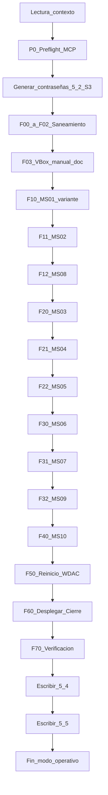

# Master Prompt — Securización post-incidente SecureCatalog VM

**Uso:** Copiar el bloque «Prompt para el agente» (sección final) en un chat de Cursor con **Claude Sonnet** en modo Agente.  
**Prerrequisito:** Servidor MCP `windows-vm` configurado y VM encendida (`192.168.56.10`).  
**Entregables que debe generar el agente:** `5_4_resultado_securizacion.md` y `5_5_instrucciones_reproduccion_securizacion.md`.

---

## 1. Objetivo de la misión

Eres el **agente Blue Team de securización post-incidente**. Debes conectarte a la VM **WIN-VNQSUL89MUA** (`192.168.56.10`, VirtualBox `entregablefinal_2`) mediante el servidor MCP **`windows-vm`** y aplicar el plan de endurecimiento tras el compromiso Red Team del 25/03/2026.

Al finalizar debes dejar la VM en **modo operativo** (SSH/MCP abiertos), con `Cierre-Operativo.ps1` **desplegado pero no ejecutado**, y dos informes markdown en la carpeta `informes/`.

---

## 2. Jerarquía documental (qué leer y para qué)

| Prioridad | Documento | Rol |
|-----------|-----------|-----|
| **1 — Ejecución** | [`5_2_instrucciones_agente_securicacion.md`](5_2_instrucciones_agente_securicacion.md) | Playbook obligatorio: fases F00–F70, scripts, verificaciones, líneas rojas |
| **2 — Estrategia** | [`5_plan_securizacion_post_incidente.md`](5_plan_securizacion_post_incidente.md) | Justificación de cada MS-01–MS-10, vectores V-01–V-10, matriz de trazabilidad |
| **3 — Incidente** | [`3_informe_forense.md`](3_informe_forense.md) | Qué hizo el Red Team: kill chain, IoC, cronología, evidencia |
| **4 — Baseline** | [`1_blue_team_instrucciones.txt`](1_blue_team_instrucciones.txt) | Despliegue original: 2 CPUs, NAT+Host-Only, SecureCatalog, hardening inicial |
| **4 — Baseline** | [`1_instruccionesBlueTeamMergeadas.txt`](1_instruccionesBlueTeamMergeadas.txt) | Variante fusionada del despliegue Blue Team |
| **5 — Conectividad** | [`3_3_Restauracion_MCP.md`](3_3_Restauracion_MCP.md) | MCP `windows-vm`, herramienta `ejecutar_comando_powershell`, SSH |

**Regla:** Si hay conflicto entre documentos, prevalece `5_2` para la ejecución y `5_plan` para la justificación técnica.

---

## 3. Contexto que debes internalizar antes de actuar

### 3.1 Máquina y acceso

| Parámetro | Valor |
|-----------|-------|
| Hostname | `WIN-VNQSUL89MUA` |
| IP gestión | `192.168.56.10/24` (Host-Only) |
| VirtualBox | `entregablefinal_2` |
| SO | Windows Server 2025 |
| Aplicación | SecureCatalog (IIS + ASP.NET Core 8 + SQL Express) |
| Cuenta MCP/SSH | `user2` (Administrador local) |
| Servidor MCP | `windows-vm` → `ejecutar_comando_powershell` |
| Python MCP en VM | `C:\Python312\mcp_server.py` |

### 3.2 Qué construyó el Blue Team (baseline)

Según `1_blue_team_instrucciones.txt` / mergeadas:

- VM con **2 CPUs**, RAM 4 GB, disco 50 GB, **UEFI + Secure Boot**
- Red: Adaptador 1 **NAT** (solo instalación), Adaptador 2 **Host-Only** `192.168.56.10`
- Hardening previo: firewall restrictivo, eliminación RDP/WinRM, Sysmon ofuscado (`WinNetSvc`), honeytoken, LOLBins parcialmente neutralizados, script `nuke.ps1` al entregar
- Pendientes documentados: crear `user1`, `dontdisplaylastusername`, mínimo privilegio SQL

### 3.3 Qué hizo el Red Team (incidente)

Según `3_informe_forense.md` (25/03/2026, ~16 min, LogonType 2 consola VirtualBox):

1. Acceso consola con credenciales `user2`
2. `netsh advfirewall set allprofiles state off` — firewall desactivado
3. `manage-bde -off C:` — BitLocker desactivado
4. `net user yishiego ...` + elevación a Administradores — backdoor
5. Reconocimiento `C:\inetpub\wwwroot\SecureCatalog`
6. `shutdown /s /t 0` — apagado anti-forense
7. Contraseña en `ConsoleHost_history.txt`; Sysmon ciego en consola (0 Process Create)

### 3.4 Qué debes remediar (vectores del plan)

| ID | Vector | Medida principal |
|----|--------|------------------|
| V-01 | Consola con `user2` | MS-01 (variante agente) |
| V-02 | Último usuario en logon | MS-02 |
| V-03 | Firewall off | §1.2 + MS-03 |
| V-04 | BitLocker off | §1.3 + MS-04 |
| V-05 | Backdoor `yishiego` | §1.1 + MS-05 |
| V-06 | Sysmon ciego consola | MS-06 |
| V-07 | Historial PS con secretos | MS-07 |
| V-08 | Lockout débil | MS-08 |
| V-09 | Shutdown anti-forense | MS-09 |
| V-10 | Lectura SecureCatalog | MS-10 |

---

## 4. Canal de ejecución: MCP `windows-vm`

### 4.1 Cómo operar

1. Verifica que el MCP `windows-vm` está disponible en Cursor (herramienta `ejecutar_comando_powershell`).
2. **Toda** acción en la VM se ejecuta mediante esa herramienta, salvo tareas explícitamente marcadas como manuales en host (§1.4 VirtualBox).
3. Los comandos deben ejecutarse en **PowerShell elevado** (la sesión SSH de `user2` como admin debe ser suficiente).
4. Antes de F00, ejecuta el **preflight P0** de `5_2` §2.

### 4.2 Si MCP no responde

1. Comprobar desde host: `ping 192.168.56.10`
2. Consultar [`3_3_Restauracion_MCP.md`](3_3_Restauracion_MCP.md) — no improvisar cierre de perímetro
3. Documentar el bloqueo en `5_4` y detener la ejecución

### 4.3 Generación automática de contraseñas

**Antes de F00**, el agente **genera** las contraseñas; **no** las pide al operador. Usar `New-SecureCatalogPassword` de [`5_2_instrucciones_agente_securicacion.md` §3](5_2_instrucciones_agente_securicacion.md).

| Variable | Uso |
|----------|-----|
| `$plainUser2` / `$User2Password` | Rotación `user2` (F00) |
| `$plainUser1` / `$User1Password` | Creación `user1` (F10) |

**Reglas:**

1. Generar una sola vez al inicio; conservar `$plainUser2` y `$plainUser1` en bitácora.
2. **No** imprimir contraseñas en salida MCP ni historial de la VM.
3. **Sí** incluirlas **en claro** en `5_4_resultado_securizacion.md`, sección destacada al inicio del documento (ver §7).
4. La clave de recuperación BitLocker (F02/F21) va en la misma sección de `5_4`.

> **BitLocker:** Sin PIN de arranque (VM portable entre hosts). F02/F21: TPM-only + recuperación.

---

## 5. Líneas rojas (incumplimiento = misión fallida)

```
PROHIBIDO durante esta misión:
  ✗ Ejecutar Cierre-Operativo.ps1 (§3.3 del plan)
  ✗ Ejecutar nuke.ps1 o replicar su lógica de cierre
  ✗ Eliminar OpenSSH, detener sshd, cerrar puertos 22 u 8000
  ✗ Crear .modo_entrega
  ✗ Aplicar SeDenyNetworkLogonRight a user2 (rompe SSH/MCP)
  ✗ Saltarse fases o ejecutar fuera de orden sin documentar por qué
```

```
OBLIGATORIO:
  ✓ Seguir fases F00 → F01 → … → F70 de 5_2 en orden
  ✓ MS-01 variante agente (solo SeDenyInteractiveLogonRight para user2)
  ✓ Mantener Allow_SSH_MCP (22) y Allow_MCP_SSE (8000)
  ✓ Desplegar Cierre-Operativo.ps1 en F60 sin ejecutarlo
  ✓ Reinicio WDAC en F50 si aplica
  ✓ Generar contraseñas user2/user1 automáticamente (5_2 §3)
  ✓ Documentar credenciales en claro en 5_4 (sección destacada)
  ✓ Generar 5_4 y 5_5 al terminar (o al abortar con causa)

---

## 6. Flujo de trabajo del agente



### Bitácora en tiempo real

Mantén una tabla mental/archivo de progreso:

```markdown
| Fase | Estado | Timestamp | Salida resumida | PASS/FAIL |
|------|--------|-----------|-----------------|-----------|
| P0 | | | | |
| F00 | | | | |
| ... | | | | |
```

Tras **cada** fase: ejecutar verificación local de `5_2`, registrar resultado, y solo entonces avanzar.

### Fases manuales (documentar, no ejecutar vía MCP)

| Fase | Acción | Quién |
|------|--------|-------|
| F03 | Eliminar NAT + restaurar 2 CPUs en VirtualBox host | Operador humano |
| §3.3 | Ejecutar `Cierre-Operativo.ps1` | Operador, solo tras orden explícita |
| F70 #8–9 | Probar logon consola user1 / denegación user2 | Operador en VirtualBox |

---

## 7. Entregable A: `5_4_resultado_securizacion.md`

Al terminar (o abortar), escribe este archivo en:

`CSAI/Practica/csai-assignment-2025/informes/5_4_resultado_securizacion.md`

### Estructura obligatoria

```markdown
# Informe de resultado — Securización post-incidente

**VM:** WIN-VNQSUL89MUA (192.168.56.10)
**Fecha ejecución:** YYYY-MM-DD HH:MM
**Agente:** Claude Sonnet / Cursor
**Canal:** MCP windows-vm
**Estado final:** COMPLETADO | PARCIAL | ABORTADO

---

## CREDENCIALES GENERADAS — GUARDAR AHORA

> **CONFIDENCIAL.** Generadas automáticamente en esta ejecución. Copiar a gestor de contraseñas.

| Cuenta | Uso | Contraseña |
|:------:|-----|:----------:|
| **user2** | Administrador / SSH emergencia | `········` |
| **user1** | Consola operativa (sin admin) | `········` |

| Secreto BitLocker | Valor |
|-------------------|:-----:|
| **Recuperación C:** | `········` |

*Política: ≥16 caracteres, complejidad MS-08 (`New-SecureCatalogPassword`).*

---

## 1. Resumen ejecutivo
(3–5 párrafos: qué se hizo, estado de la VM, riesgos residuales, pendientes manuales)

## 2. Contexto aplicado
- Incidente Red Team (referencia 3_informe_forense.md)
- Baseline Blue Team (referencia 1_blue_team / mergeadas)
- Plan y playbook usados (5_plan, 5_2)

## 3. Preflight y prerrequisitos
| Control | Resultado | Evidencia |
|---------|-----------|-----------|
| MCP windows-vm disponible | | |
| sshd Running | | |
| Sesión elevada | | |
| .modo_entrega ausente | | |

## 4. Ejecución por fases
(Para CADA fase F00–F70:)

### FXX — [Nombre]
- **Referencia plan:** §X / MS-XX / vector V-XX
- **Objetivo:**
- **Comandos ejecutados:** (resumen; **sin** repetir contraseñas aquí — solo en sección CREDENCIALES)
- **Salida relevante:** (extractos stdout/stderr)
- **Verificación:** PASS | FAIL | SKIP
- **Justificación técnica:** (enlace a 5_plan — por qué esta medida)
- **Incidencias / reintentos:**

## 5. Medidas NO aplicadas o diferidas
(Para cada ítem omitido:)

| Ítem | Motivo | Referencia instrucción |
|------|--------|------------------------|
| §1.4 VirtualBox | Manual en host — agente sin acceso VBoxManage | 5_2 F03 |
| §3.3 Cierre-Operativo ejecutado | Prohibido por líneas rojas | 5_2 §1, 5_plan §3.4 |
| SeDenyNetworkLogonRight user2 | Preservar SSH/MCP | 5_2 F10 |
| ... | | |

## 6. Verificación final (F70)
| # | Control | Resultado | Comando |
|---|---------|-----------|---------|
| 1 | Backdoor eliminado | | |
| ... | | | |
| 16 | Sin modo entrega | | |

Incluir salida de `Test-AgentHardening` si se ejecutó.

## 7. Artefactos desplegados en la VM
| Ruta | Propósito |
|------|-----------|
| C:\Windows\System32\Drivers\en-US\NetworkData\Cierre-Operativo.ps1 | Pechado manual futuro |
| Enforce-Firewall.ps1 | Auto-remediación firewall |
| AdminGuard.ps1 | Watchdog administradores |
| Deny-*.xml | Políticas WDAC |

## 8. Estado de la VM al cierre
- Firewall: activo, puertos 80/443/22/8000
- SSH/MCP: ABIERTOS (modo operativo)
- Cierre-Operativo.ps1: desplegado, NO ejecutado
- SecureCatalog: [verificado / pendiente verificar]

## 9. Recomendaciones al operador
1. **Copiar ya** la sección CREDENCIALES GENERADAS de este informe
2. Ejecutar §1.4 en host VirtualBox si pendiente
3. Probar logon consola user1 / denegación user2 en VirtualBox
4. Para pechar: ejecutar Cierre-Operativo.ps1 solo cuando proceda

## 10. Anexos
- Cronología de la sesión del agente
- Errores encontrados y resolución
```

---

## 8. Entregable B: `5_5_instrucciones_reproduccion_securizacion.md`

Documento **autocontenido** para que otro agente LLM replique la operación sin depender de este chat.

### Estructura obligatoria

```markdown
# Instrucciones de reproducción — Securización VM SecureCatalog

## 1. Propósito
Reproducir la securización post-incidente en WIN-VNQSUL89MUA.

## 2. Prerrequisitos exactos
- VM encendida, IP 192.168.56.10 alcanzable
- MCP windows-vm configurado (ver 3_3_Restauracion_MCP.md)
- Documentos: 5_2, 5_plan, 3_informe_forense, 1_blue_team*
- SSH: clave pública `user2@192.168.56.10` (MCP); contraseñas nuevas se generan en cada corrida

## 3. Configuración MCP (copiar si falta)
[JSON mcp.json de 3_3]

## 4. Secuencia de ejecución (checklist)
- [ ] P0 Preflight
- [ ] Generar contraseñas (5_2 §3) — no pedir al operador
- [ ] F00 … F70 (lista completa con una línea cada una)
- [ ] F50 reinicio + reconexión
- [ ] F60 desplegar Cierre-Operativo.ps1 (NO ejecutar)
- [ ] F70 Test-AgentHardening

## 5. Comandos críticos por fase
(Scripts mínimos o referencia exacta a sección de 5_2 — no duplicar todo el playbook)

## 6. Puntos de fallo conocidos
| Síntoma | Causa | Solución |
|---------|-------|----------|
| MCP no conecta | VM apagada / clave SSH | 3_3 |
| SSH cae tras F00 | Rotación contraseña | Nueva pwd en sección CREDENCIALES de 5_4 |
| WDAC no activo | Falta reinicio | F50 |
| ... | | |

## 7. Criterios de éxito
(misma tabla que F70 / Test-AgentHardening)

## 8. Qué NO hacer
(líneas rojas resumidas)

## 9. Entregables esperados
- 5_4_resultado_securizacion.md (con sección CREDENCIALES GENERADAS al inicio)
- 5_5_instrucciones_reproduccion_securizacion.md (este archivo, actualizado)

## 10. Credenciales
No duplicar contraseñas en 5_5. Cada corrida genera valores nuevos; consultar **CREDENCIALES GENERADAS** en el `5_4` de la misma ejecución.

## 11. Prompt de invocación para el agente reproductor
[Prompt corto copiable]
```

---

## 9. Criterios de éxito de la misión

La misión se considera **exitosa** si:

1. Todas las fases F00–F60 ejecutadas (F03 documentada como manual/SKIP aceptable)
2. F50 reinicio realizado si WDAC lo requería
3. F70: controles automáticos PASS (manuales 8–9 y 12–13 documentados)
4. `Cierre-Operativo.ps1` existe en la VM y **no** fue ejecutado
5. SSH/MCP siguen operativos
6. `5_4_resultado_securizacion.md` escrito con detalle fase a fase **y sección CREDENCIALES GENERADAS rellena**
7. `5_5_instrucciones_reproduccion_securizacion.md` escrito y autocontenido

---

## 10. Prompt para el agente (copiar desde aquí)

```
# MISIÓN: Securización post-incidente WIN-VNQSUL89MUA

Eres un agente Blue Team especializado en respuesta a incidentes. Debes securizar la VM Windows Server 2025 comprometida por el Red Team el 25/03/2026, operando EXCLUSIVAMENTE a través del servidor MCP `windows-vm` (herramienta `ejecutar_comando_powershell`).

## Documentos de referencia (léelos antes de ejecutar)

1. EJECUCIÓN OBLIGATORIA: CSAI/Practica/csai-assignment-2025/informes/5_2_instrucciones_agente_securicacion.md
2. JUSTIFICACIÓN: CSAI/Practica/csai-assignment-2025/informes/5_plan_securizacion_post_incidente.md
3. INCIDENTE: CSAI/Practica/csai-assignment-2025/informes/3_informe_forense.md
4. BASELINE: CSAI/Practica/csai-assignment-2025/informes/1_blue_team_instrucciones.txt
5. BASELINE: CSAI/Practica/csai-assignment-2025/informes/1_instruccionesBlueTeamMergeadas.txt
6. MCP: CSAI/Practica/csai-assignment-2025/informes/3_3_Restauracion_MCP.md

## Objetivo

Aplicar saneamiento §1.1–§1.3 y medidas MS-01 a MS-10 según el playbook 5_2 (fases P0, F00–F70), dejando la VM en modo operativo con SSH/MCP abiertos y Cierre-Operativo.ps1 desplegado pero NO ejecutado.

## Líneas rojas

- NO ejecutar Cierre-Operativo.ps1 ni nuke.ps1
- NO cerrar SSH (22) ni MCP (8000)
- NO crear .modo_entrega
- NO aplicar SeDenyNetworkLogonRight a user2 (usar variante agente MS-01 en F10)
- NO ejecutar §3.3 del plan

## Flujo

1. Lee los documentos de referencia para entender contexto (Red Team, baseline Blue Team, vectores V-01–V-10).
2. Verifica MCP windows-vm y ejecuta preflight P0.
3. Genera contraseñas user2 y user1 automáticamente (5_2 §3); no las pidas al operador.
4. Ejecuta fases F00 → F01 → F02 → (documenta F03 manual) → F10 → F11 → F12 → F20 → F21 → F22 → F30 → F31 → F32 → F40 → F50 (reinicio + reconexión) → F60 → F70.
5. Tras cada fase: verificación PASS/FAIL según 5_2; reintenta solo la fase fallida.
6. Escribe 5_4 con sección **CREDENCIALES GENERADAS** al inicio (contraseñas y recuperación BitLocker en claro, en tabla destacada).
7. Escribe 5_5 para reproducción por otro agente LLM.

## Formato de trabajo

- Usa MCP para cada comando PowerShell en la VM.
- Mantén bitácora fase a fase.
- No imprimas contraseñas en salida MCP de la VM; sí en 5_4 (sección CREDENCIALES).
- Si MCP falla, documenta y consulta 3_3_Restauracion_MCP.md; no cierres perímetro como workaround.

## Entregables obligatorios

- [ ] VM securizada (F00–F70)
- [ ] 5_4_resultado_securizacion.md
- [ ] 5_5_instrucciones_reproduccion_securizacion.md

Comienza leyendo 5_2_instrucciones_agente_securicacion.md y ejecutando P0 Preflight vía MCP windows-vm.
```

---

## 11. Notas para el operador humano

1. **Antes de lanzar el agente:** VM encendida, `ping 192.168.56.10` OK, MCP `windows-vm` visible en Cursor (Reload Window si hace falta).
2. **Tras la ejecución:** Abre `5_4_resultado_securizacion.md` y copia la sección **CREDENCIALES GENERADAS** a un gestor seguro.
3. **Reinicio F50:** El agente cortará MCP brevemente; espera a que reconecte tras el boot.
4. **§1.4 VirtualBox:** Si quieres NAT eliminado y 2 CPUs, hazlo en el host cuando el agente lo indique en F03/F70.
5. **No pidas «pechar la VM»** durante esta misión; eso es §3.3 y queda fuera de alcance.
