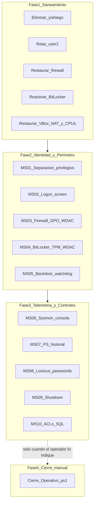

# Plan de Securización Post-Incidente — SecureCatalog VM

**Caso:** Compromiso y remediación del servidor WIN-VNQSUL89MUA  
**Sistema afectado:** Windows Server 2025 — `192.168.56.10`  
**Aplicación desplegada:** SecureCatalog (IIS + ASP.NET Core 8 + SQL Server Express)  
**Incidente confirmado:** 25 de marzo de 2026  
**Periodo de exposición:** 03/03/2026 – 07/04/2026  
**Autor:** Blue Team — Especialista en Respuesta a Incidentes  
**Fecha del plan:** 25 de junio de 2026  
**Clasificación:** CONFIDENCIAL  

> **Documento fusionado** a partir de los planes individuales `5(composer)_plan_securizacion_post_incidente.md` y `5(sonnet)_plan_securizacion_post_incidente.md`, consolidando todas las medidas aplicables sin duplicar controles redundantes.

---

## 0. Resumen Ejecutivo

El servidor **WIN-VNQSUL89MUA** fue comprometido el **25/03/2026** mediante acceso interactivo local (LogonType 2) a la consola de VirtualBox con credenciales del administrador `user2`. En una sesión de ~16 minutos, el Red Team desactivó el firewall, desactivó BitLocker, creó la cuenta backdoor `yishiego` con privilegios de Administrador, reconoció la aplicación SecureCatalog y apagó el sistema para borrar evidencia volátil.

El hardening inicial (firewall restrictivo, eliminación de SSH/RDP/WinRM, honeytoken, neutralización parcial de LOLBins, Sysmon ofuscado) **contuvo el vector remoto**, pero dejó brechas en: separación de privilegios en consola (`user1` pendiente), telemetría Sysmon limitada a IIS, ausencia de `net.exe`/`netsh.exe`/`manage-bde.exe` en LOLBins, exposición de credenciales en historial de PowerShell, y controles anti-manipulación insuficientes sobre firewall y BitLocker.

Este plan define **diez medidas de securización** (MS-01 a MS-10) más una **fase de cierre operativo diferida** (§3), cada una vinculada a vectores confirmados en el informe forense. Los métodos de aplicación son idempotentes mediante PowerShell, GPO y Registro nativos de Windows Server 2025.

> **Política de canal de gestión (SSH / MCP):** Durante la ejecución del plan —incluidos reintentos de etapas fallidas por un LLM o analista— **no se deben eliminar SSH ni MCP ni cerrar sus puertos en el firewall**. El Blue Team opera la VM mediante **OpenSSH (TCP 22)** y el servidor **MCP** (transporte principal por stdio/SSH; puerto **TCP 8000** reservado para SSE si está desplegado). El corte de esas vías queda relegado al script **`Cierre-Operativo.ps1`** (§3), que el operador ejecuta **manualmente y solo cuando da por finalizado el trabajo** en la VM.



### Vectores confirmados (alcance estricto)

| ID | Vector / Debilidad | Evidencia |
|----|-------------------|-----------|
| V-01 | Acceso consola VirtualBox con credenciales `user2` (LogonType 2) | Informe forense §3.7 |
| V-02 | Exposición de usuario en pantalla de logon (`dontdisplaylastusername` pendiente) | Hardening inicial §432-437 |
| V-03 | Desactivación firewall: `netsh advfirewall set allprofiles state off` | Historial PowerShell §3.3 |
| V-04 | Desactivación BitLocker: `manage-bde -off C:` | Historial PowerShell §3.3 |
| V-05 | Cuenta backdoor: `net user yishiego` + elevación a Administradores | Eventos 4720/4732 |
| V-06 | Punto ciego Sysmon: 0 eventos Process Create en consola | Informe forense §3.5 |
| V-07 | Contraseña expuesta en `ConsoleHost_history.txt` | Informe forense §3.3 |
| V-08 | Política de bloqueo débil (10 intentos) y credenciales comprometidas | Hardening §439-443 |
| V-09 | Apagado anti-forense: `shutdown /s /t 0` | Historial PowerShell §3.3 |
| V-10 | Reconocimiento de `C:\inetpub\wwwroot\SecureCatalog` | Historial PowerShell §3.3 |

> **Nota sobre acceso físico:** El informe forense confirma que el Red Team entró por consola VirtualBox (LogonType 2), vector **previsto y autorizado** en el ejercicio. No se endurece el hipervisor para bloquear ese acceso; las medidas MS-01 a MS-10 limitan el impacto una vez obtenida la sesión en el guest.

---

## 1. Saneamiento Inmediato (Pre-Endurecimiento)

> **Prerequisito:** Ejecutar desde consola de la VM o **vía SSH/MCP** con sesión elevada. Todos los scripts son idempotentes. Esta fase debe completarse **antes** de aplicar MS-01 en adelante. **No ejecutar `Cierre-Operativo.ps1` durante el saneamiento.**  
> **Credenciales (agente LLM):** El agente **genera** las contraseñas de `user2` y `user1` automáticamente (`New-SecureCatalogPassword` en `5_2` §3); no usa `Read-Host` ni pide valores al operador. Los literales se documentan en `5_4_resultado_securizacion.md`.

### 1.1 Eliminación de la cuenta backdoor y saneamiento del grupo Administradores

```powershell
if (Get-LocalUser -Name 'yishiego' -ErrorAction SilentlyContinue) {
    Remove-LocalUser -Name 'yishiego'
    Write-Host '[+] Cuenta yishiego eliminada.' -ForegroundColor Green
} else {
    Write-Host '[=] Cuenta yishiego no existe (ya saneada).' -ForegroundColor Gray
}

$whitelist = @('user2')
Get-LocalGroupMember -Group 'Administradores' |
    Where-Object { $_.ObjectClass -eq 'User' -and $_.Name -notmatch 'Administrator$' } |
    ForEach-Object {
        $shortName = ($_.Name -split '\\')[-1]
        if ($whitelist -notcontains $shortName) {
            Remove-LocalGroupMember -Group 'Administradores' -Member $_.Name -ErrorAction SilentlyContinue
            Disable-LocalUser -Name $shortName -ErrorAction SilentlyContinue
            Write-Host "[-] Eliminado de Administradores: $shortName" -ForegroundColor Yellow
        }
    }

$newPasswordPlain = $plainUser2   # Generado en 5_2 §3 antes de F00
$newPassword = $User2Password     # SecureString ya creado
Set-LocalUser -Name 'user2' -Password $newPassword -PasswordNeverExpires $false
Write-Host '[+] Contraseña de user2 rotada.' -ForegroundColor Green
# Agente LLM: $plainUser2 ya está en bitácora para 5_4 (no imprimir en consola)
```

> **Ejecución por agente LLM:** Usar `$plainUser2` / `$User2Password` generados en `5_2` §3. Documentar `$plainUser2` en `5_4_resultado_securizacion.md` (sección CREDENCIALES).

### 1.2 Restauración del Firewall de Windows (modo operativo Blue Team)

Durante la ejecución del plan el firewall permanece **activo y restrictivo**, pero debe conservar los puertos de gestión del Blue Team además de HTTP/HTTPS de SecureCatalog.

```powershell
Set-NetFirewallProfile -Profile Domain,Public,Private -Enabled True `
    -DefaultInboundAction Block -DefaultOutboundAction Block

# Reglas de servicio (idempotente)
$operationalRules = @(
    @{ Name = 'Allow_HTTP_In';    Port = 80  },
    @{ Name = 'Allow_HTTPS_In';   Port = 443 },
    @{ Name = 'Allow_SSH_MCP';    Port = 22  },   # OpenSSH — canal LLM/analista
    @{ Name = 'Allow_MCP_SSE';    Port = 8000 }   # MCP SSE (si está desplegado)
)
foreach ($r in $operationalRules) {
    if (-not (Get-NetFirewallRule -DisplayName $r.Name -ErrorAction SilentlyContinue)) {
        New-NetFirewallRule -DisplayName $r.Name -Direction Inbound `
            -Protocol TCP -LocalPort $r.Port -Action Allow | Out-Null
    } else {
        Enable-NetFirewallRule -DisplayName $r.Name
    }
}

# Forzar estado via registro de políticas (precedencia sobre netsh)
$fwPolicy = 'HKLM:\SOFTWARE\Policies\Microsoft\WindowsFirewall'
@('DomainProfile', 'StandardProfile', 'PublicProfile') | ForEach-Object {
    $p = Join-Path $fwPolicy $_
    if (-not (Test-Path $p)) { New-Item -Path $p -Force | Out-Null }
    Set-ItemProperty -Path $p -Name 'EnableFirewall' -Value 1 -Type DWord
}
Write-Host '[+] Firewall restaurado (modo operativo: 80, 443, 22, 8000).' -ForegroundColor Green
```

> **Importante:** Los puertos 22 y 8000 se eliminan del firewall únicamente al ejecutar `Cierre-Operativo.ps1` (§3). No replicar la política del antiguo `nuke.ps1` hasta esa fase.

### 1.3 Reactivación de BitLocker

```powershell
$blv = Get-BitLockerVolume -MountPoint 'C:'
if ($blv.ProtectionStatus -ne 'On' -or $blv.VolumeStatus -ne 'FullyEncrypted') {
    if (-not ($blv.KeyProtector | Where-Object { $_.KeyProtectorType -eq 'Tpm' })) {
        Add-BitLockerKeyProtector -MountPoint 'C:' -TpmProtector
    }
    if (-not ($blv.KeyProtector | Where-Object { $_.KeyProtectorType -eq 'RecoveryPassword' })) {
        $recovery = Add-BitLockerKeyProtector -MountPoint 'C:' -RecoveryPasswordProtector
        Write-Host "[!] GUARDAR clave de recuperación: $($recovery.RecoveryPassword)" -ForegroundColor Red
    }
    Enable-BitLocker -MountPoint 'C:' -EncryptionMethod Aes256 -TpmProtector -UsedSpaceOnly
    Write-Host '[+] BitLocker reactivado en C:.' -ForegroundColor Green
}
Get-BitLockerVolume -MountPoint 'C:' | Select-Object MountPoint, VolumeStatus, ProtectionStatus
```

### 1.4 Restauración de configuración VirtualBox (host)

El despliegue inicial del Blue Team definió la VM con **2 CPUs** y **Adaptador 1: NAT** (solo para la fase de instalación) más **Adaptador 2: Host-Only** (`192.168.56.10/24`). En los pendientes de entrega figuraba **«Todo: eliminar adaptador NAT»**. Tras el incidente, la VM puede haber quedado con el adaptador NAT aún habilitado y con **4 procesadores** en lugar de los 2 originales. El informe forense no documenta explotación de red como vector de entrada; el perímetro del guest funcionó correctamente. Esta sección restaura la topología y recursos previstos al pechar la máquina.

**Acciones post-incidente obligatorias (host VirtualBox, VM apagada):**

#### 1.4.1 Eliminar el adaptador NAT

1. `Configuración → Red → Adaptador 1` → desmarcar **Conectado** y, si la opción está disponible, seleccionar **No conectado** / deshabilitar el adaptador.
2. Repetir la comprobación en **Adaptador 2** (y siguientes): ningún adaptador debe estar en modo **NAT**. El único adaptador activo debe ser **Host-Only** (`192.168.56.0/24`).
3. Arrancar la VM y verificar en consola del guest:

```powershell
Get-NetAdapter | Where-Object Status -eq 'Up' | Format-Table Name, InterfaceDescription, Status -AutoSize
ipconfig
# Esperado: una sola interfaz activa en 192.168.56.10/24, sin dirección 10.0.2.x (rango NAT de VirtualBox)
```

#### 1.4.2 Restaurar el número de procesadores a 2

La configuración baseline del Blue Team especifica **2 CPUs** (`1_blue_team_instrucciones.txt`, Fase 1.1). Si la VM tiene 4 procesadores, reducirla al valor original.

1. Con la VM **apagada**: `Configuración → Sistema → Procesador`.
2. Establecer **Número de procesadores: 2**.
3. Aceptar y arrancar la VM. Verificar en consola:

```powershell
(Get-CimInstance Win32_ComputerSystem).NumberOfLogicalProcessors
# Esperado: 2
```

**Línea de comandos VirtualBox (alternativa idempotente en el host):**

```bash
# Sustituir "NombreVM" por el nombre de la máquina en VirtualBox
VBoxManage modifyvm "NombreVM" --nic1 none
VBoxManage modifyvm "NombreVM" --cpus 2
VBoxManage showvminfo "NombreVM" | findstr /i "NIC Number CPUs"
```

No se requiere acción adicional sobre UEFI ni Secure Boot: ambos se habilitaron en la Fase 1 del despliegue Blue Team antes de activar BitLocker con protector TPM.

---

## 2. Medidas de Endurecimiento Avanzado

---

### MS-01 — Separación de privilegios y restricción del acceso interactivo local

#### 1. ID del Incidente / Vector de Ataque

**V-01.** El Red Team accedió por consola VirtualBox (LogonType 2, origen `127.0.0.1`) con credenciales de `user2`, evadiendo el perímetro de red. El hardening documentó la creación de `user1` sin privilegios como pendiente no ejecutado.

#### 2. Nueva Medida de Seguridad

Implementar modelo **Privileged Access Workstation** en el entorno lab:

- Crear cuenta operativa `user1` (sin membresía en Administradores) para uso diario en consola.
- Denegar logon interactivo a `user2` vía `SeDenyInteractiveLogonRight` / `SeDenyNetworkLogonRight`.
- Restringir `SeInteractiveLogonRight` exclusivamente a `user1`.
- Habilitar **Windows Hello for Business** con TPM 2.0 para `user1`, sustituyendo autenticación por contraseña estática.

#### 3. Justificación Técnica

Operar siempre como `user2` (Administrador) concede control total ante cualquier compromiso de credenciales (T1078). Separar sesión operativa (`user1`) de sesión privilegiada (`user2`, solo break-glass) reduce el impacto. Windows Hello for Business vincula autenticación a clave privada residente en TPM 2.0, inutilizable con contraseñas capturadas. La restricción de `SeInteractiveLogonRight` hace que el LSA rechace logon de cuentas no autorizadas con Event ID 4625 (`0xC000015B`).

#### 4. Método de Aplicación

**PowerShell (idempotente):**

```powershell
# Crear user1 si no existe ($User1Password / $plainUser1 generados en 5_2 §3)
if (-not (Get-LocalUser -Name 'user1' -ErrorAction SilentlyContinue)) {
    $pass = $User1Password        # SecureString; $plainUser1 en bitácora para 5_4
    New-LocalUser -Name 'user1' -Password $pass -Description 'Cuenta operativa sin privilegios' -PasswordNeverExpires $false
    Add-LocalGroupMember -Group 'Usuarios' -Member 'user1'
    Write-Host '[+] user1 creado.' -ForegroundColor Green
}

# Restricción de derechos de logon via secedit
secedit /export /cfg C:\Windows\Temp\sec_logon.cfg /quiet
$cfg = Get-Content C:\Windows\Temp\sec_logon.cfg
$cfg = $cfg -replace '^SeInteractiveLogonRight\s*=.*', 'SeInteractiveLogonRight = user1'
$cfg = $cfg -replace '^SeDenyInteractiveLogonRight\s*=.*', 'SeDenyInteractiveLogonRight = user2,DefaultAccount,WDAGUtilityAccount,user3'
$cfg = $cfg -replace '^SeDenyNetworkLogonRight\s*=.*', 'SeDenyNetworkLogonRight = user2'
$cfg | Set-Content C:\Windows\Temp\sec_logon.cfg -Encoding Unicode
secedit /configure /db $env:windir\security\local.sdb /cfg C:\Windows\Temp\sec_logon.cfg /areas USER_RIGHTS
Remove-Item C:\Windows\Temp\sec_logon.cfg -Force
gpupdate /force

# Windows Hello for Business
$whfb = 'HKLM:\SOFTWARE\Policies\Microsoft\PassportForWork'
if (-not (Test-Path $whfb)) { New-Item -Path $whfb -Force | Out-Null }
Set-ItemProperty -Path $whfb -Name 'Enabled' -Value 1 -Type DWord
Set-ItemProperty -Path $whfb -Name 'RequireSecurityDevice' -Value 1 -Type DWord
Write-Host '[+] MS-01 aplicada.' -ForegroundColor Green
```

**GPO:** `Configuración de equipo → Configuración de Windows → Configuración de seguridad → Directivas locales → Asignación de derechos de usuario → Denegar inicio de sesión local → user2`

---

### MS-02 — Ocultación de cuentas en pantalla de logon

#### 1. ID del Incidente / Vector de Ataque

**V-02.** El hardening intentó `dontdisplaylastusername` pero quedó como **PENDIENTE — No funciona**, facilitando el targeting de `user2` en consola.

#### 2. Nueva Medida de Seguridad

Aplicar `dontdisplaylastusername`, `DontDisplayLastUserName` y `HideFastUserSwitching` mediante registro y GPO.

#### 3. Justificación Técnica

Winlogon lee `HKLM\SOFTWARE\Microsoft\Windows\CurrentVersion\Policies\System` al renderizar la pantalla de logon. Sin estas claves, el último usuario autenticado queda visible, reduciendo el espacio de búsqueda del atacante a una sola contraseña.

#### 4. Método de Aplicación

**Registro:**

| Key | Path | Value | Tipo | Datos |
|-----|------|-------|------|-------|
| HKLM | `SOFTWARE\Microsoft\Windows\CurrentVersion\Policies\System` | `dontdisplaylastusername` | REG_DWORD | `1` |
| HKLM | `SOFTWARE\Microsoft\Windows\CurrentVersion\Policies\System` | `DontDisplayLastUserName` | REG_DWORD | `1` |
| HKLM | `SOFTWARE\Microsoft\Windows\CurrentVersion\Policies\System` | `HideFastUserSwitching` | REG_DWORD | `1` |

```powershell
$path = 'HKLM:\SOFTWARE\Microsoft\Windows\CurrentVersion\Policies\System'
@('dontdisplaylastusername', 'DontDisplayLastUserName', 'HideFastUserSwitching') |
    ForEach-Object { Set-ItemProperty -Path $path -Name $_ -Value 1 -Type DWord -Force }
gpupdate /force
Write-Host '[+] MS-02 aplicada.' -ForegroundColor Green
```

**GPO:** `Configuración de equipo → Plantillas administrativas → Sistema → Inicio de sesión → Ocultar nombres de usuario en la pantalla de inicio de sesión → Habilitado`

---

### MS-03 — Protección contra desactivación del Firewall de Windows

#### 1. ID del Incidente / Vector de Ataque

**V-03.** El Red Team ejecutó `netsh advfirewall set allprofiles state off`, anulando la política del `nuke.ps1` hasta la recuperación del 07/04/2026.

#### 2. Nueva Medida de Seguridad

Defensa en profundidad en tres capas, **sin cerrar SSH ni MCP** mientras dure el modo operativo:

- **GPO/registro forzado** en `HKLM:\SOFTWARE\Policies\Microsoft\WindowsFirewall` (MPSSVC ignora desactivación manual).
- **WDAC** que deniega ejecución de `netsh.exe` en contexto interactivo (no afecta a la gestión por PowerShell remoto vía SSH).
- **Tarea SYSTEM** de auto-remediación cada 5 minutos que restaura el firewall **y reabre los puertos 80, 443, 22 y 8000** si fueron alterados.

El paso a política de solo HTTP/HTTPS (sin 22/8000) queda en `Cierre-Operativo.ps1` (§3).

#### 3. Justificación Técnica

`netsh.exe` comunica con BFE/mpssvc para deshabilitar `wfplwfs.sys`. Las políticas en `SOFTWARE\Policies` tienen precedencia y ACL restringida. WDAC (`CI.dll`) bloquea el proceso antes de su creación. La tarea SYSTEM restaura el estado si cualquier vía logra desactivarlo.

#### 4. Método de Aplicación

```powershell
# Capa 1: Política de firewall forzada
Set-NetFirewallProfile -Profile Domain,Public,Private -Enabled True `
    -DefaultInboundAction Block -DefaultOutboundAction Block -NotifyOnListen False

# Capa 2: Tarea de auto-remediación (preserva puertos operativos Blue Team)
$scriptPath = 'C:\Windows\System32\Drivers\en-US\NetworkData\Enforce-Firewall.ps1'
@'
$marker = 'C:\Windows\System32\Config\TxR\Diagnostics\.modo_entrega'
if (Test-Path $marker) { return }  # Tras Cierre-Operativo.ps1, no reabrir SSH/MCP

foreach ($p in Get-NetFirewallProfile) {
    if (-not $p.Enabled) {
        Set-NetFirewallProfile -Name $p.Name -Enabled True `
            -DefaultInboundAction Block -DefaultOutboundAction Block
        "$((Get-Date).ToString('o')) FIREWALL_RESTORED Profile=$($p.Name)" |
            Out-File 'C:\Windows\System32\Config\TxR\Diagnostics\fw_enforce.log' -Append
    }
}
$required = @(
    @{ Name = 'Allow_HTTP_In';  Port = 80  },
    @{ Name = 'Allow_HTTPS_In'; Port = 443 },
    @{ Name = 'Allow_SSH_MCP';  Port = 22  },
    @{ Name = 'Allow_MCP_SSE';  Port = 8000 }
)
foreach ($r in $required) {
    if (-not (Get-NetFirewallRule -DisplayName $r.Name -EA SilentlyContinue)) {
        New-NetFirewallRule -DisplayName $r.Name -Direction Inbound -Protocol TCP `
            -LocalPort $r.Port -Action Allow | Out-Null
    } else {
        Enable-NetFirewallRule -DisplayName $r.Name -ErrorAction SilentlyContinue
    }
}
'@ | Set-Content $scriptPath -Encoding UTF8

$action    = New-ScheduledTaskAction -Execute 'powershell.exe' `
    -Argument "-NoProfile -ExecutionPolicy Bypass -File `"$scriptPath`""
$trigger   = New-ScheduledTaskTrigger -Once -At (Get-Date) `
    -RepetitionInterval (New-TimeSpan -Minutes 5) -RepetitionDuration ([TimeSpan]::MaxValue)
$principal = New-ScheduledTaskPrincipal -UserId 'NT AUTHORITY\SYSTEM' `
    -LogonType ServiceAccount -RunLevel Highest
Register-ScheduledTask -TaskName 'BlueTeam_FirewallEnforce' -Action $action `
    -Trigger $trigger -Principal $principal -Force | Out-Null

# Capa 3: WDAC Deny netsh.exe
$wdacPath = 'C:\Windows\System32\Drivers\en-US\NetworkData\Deny-Netsh.xml'
@'
<?xml version="1.0" encoding="utf-8"?>
<SiPolicy xmlns="urn:schemas-microsoft-com:sipolicy">
  <VersionEx>10.0.0.0</VersionEx>
  <PlatformID>{2E07F7E4-194F-4B20-AB0D-4B4E82BFCA2B}</PlatformID>
  <Rules>
    <Rule Type="Deny" Id="ID_DENY_NETSH">
      <Conditions>
        <FilePublisherCondition PublisherName="O=MICROSOFT CORPORATION, L=REDMOND, S=WASHINGTON, C=US"
          ProductName="MICROSOFT® WINDOWS® OPERATING SYSTEM" BinaryName="NETSH.EXE">
          <BinaryVersionRange LowSection="*" HighSection="*" />
        </FilePublisherCondition>
      </Conditions>
    </Rule>
  </Rules>
</SiPolicy>
'@ | Set-Content $wdacPath -Encoding UTF8
CiTool.exe --update-policy $wdacPath

# Auditoría complementaria de cambios en firewall
auditpol /set /subcategory:"MPSSVC Rule-Level Policy Change" /success:enable /failure:enable
Write-Host '[+] MS-03 aplicada (reinicio requerido para WDAC).' -ForegroundColor Green
```

**GPO:** `Configuración de equipo → Plantillas administrativas → Red → Configuración del firewall de Windows → Perfil de dominio/privado/público → Estado del firewall → Habilitado`

---

### MS-04 — Protección contra desactivación de BitLocker

#### 1. ID del Incidente / Vector de Ataque

**V-04.** El Red Team ejecutó `manage-bde -off C:`. El protector TPM-only permitía descifrado sin factor adicional. `manage-bde.exe` no estaba en la lista de LOLBins neutralizados.

#### 2. Nueva Medida de Seguridad

- Mantener protector **TPM-only** (sin PIN de arranque): la VM debe poder ejecutarse en cualquier host VirtualBox sin prompt de PIN en consola.
- Garantizar protector de **recuperación** documentado.
- GPO FVE: `EnableBDEWithNoTPM=0`, `UseTPMPIN=0` (no exigir PIN con TPM), `RDVDenyWriteAccess=1`.
- WDAC Deny para `manage-bde.exe` en sesiones interactivas.

> **Exclusión deliberada:** No se usa TPM+PIN. Un PIN de arranque impediría o complicaría el arranque al migrar la VM entre hosts o al operar sin consola física.

#### 3. Justificación Técnica

El vector V-04 explotó `manage-bde -off` con volumen desbloqueado en sesión interactiva, no la ausencia de PIN. La defensa prioritaria es **WDAC** (bloqueo de `manage-bde.exe` en consola), política FVE que exige TPM y auditoría. TPM-only permite arranque automático tras migración de la VM manteniendo cifrado en reposo vinculado al vTPM del hipervisor. La clave de recuperación cubre escenarios de cambio de TPM/host.

#### 4. Método de Aplicación

```powershell
$vol = Get-BitLockerVolume -MountPoint 'C:'
if ($vol.ProtectionStatus -eq 'Off') {
    if (-not ($vol.KeyProtector | Where-Object { $_.KeyProtectorType -eq 'Tpm' })) {
        Add-BitLockerKeyProtector -MountPoint 'C:' -TpmProtector
    }
    if (-not ($vol.KeyProtector | Where-Object { $_.KeyProtectorType -eq 'RecoveryPassword' })) {
        $recovery = Add-BitLockerKeyProtector -MountPoint 'C:' -RecoveryPasswordProtector
        Write-Host "[!] GUARDAR clave de recuperación: $($recovery.RecoveryPassword)" -ForegroundColor Red
    }
    Enable-BitLocker -MountPoint 'C:' -EncryptionMethod Aes256 -TpmProtector -UsedSpaceOnly
} elseif (-not ($vol.KeyProtector | Where-Object { $_.KeyProtectorType -eq 'Tpm' })) {
    Add-BitLockerKeyProtector -MountPoint 'C:' -TpmProtector
}

# Política FVE via registro (sin PIN de arranque)
$fvePath = 'HKLM:\SOFTWARE\Policies\Microsoft\FVE'
if (-not (Test-Path $fvePath)) { New-Item -Path $fvePath -Force | Out-Null }
Set-ItemProperty -Path $fvePath -Name 'EnableBDEWithNoTPM' -Value 0 -Type DWord
Set-ItemProperty -Path $fvePath -Name 'UseTPMPIN'        -Value 0 -Type DWord
Set-ItemProperty -Path $fvePath -Name 'RDVDenyWriteAccess' -Value 1 -Type DWord

# WDAC Deny manage-bde.exe
$wdacBde = 'C:\Windows\System32\Drivers\en-US\NetworkData\Deny-ManageBde.xml'
@'
<?xml version="1.0" encoding="utf-8"?>
<SiPolicy xmlns="urn:schemas-microsoft-com:sipolicy">
  <VersionEx>10.0.0.0</VersionEx>
  <PlatformID>{2E07F7E4-194F-4B20-AB0D-4B4E82BFCA2B}</PlatformID>
  <Rules>
    <Rule Type="Deny" Id="ID_DENY_MANAGEBDE">
      <Conditions>
        <FilePublisherCondition PublisherName="O=MICROSOFT CORPORATION, L=REDMOND, S=WASHINGTON, C=US"
          ProductName="MICROSOFT® WINDOWS® OPERATING SYSTEM" BinaryName="MANAGE-BDE.EXE">
          <BinaryVersionRange LowSection="*" HighSection="*" />
        </FilePublisherCondition>
      </Conditions>
    </Rule>
  </Rules>
</SiPolicy>
'@ | Set-Content $wdacBde -Encoding UTF8
CiTool.exe --update-policy $wdacBde
auditpol /set /subcategory:"Other System Events" /success:enable /failure:enable
Write-Host '[+] MS-04 aplicada.' -ForegroundColor Green
```

**GPO:** `Configuración de equipo → Plantillas administrativas → Componentes de Windows → Cifrado de unidad BitLocker → Unidades del sistema operativo → Permitir BitLocker sin un TPM compatible → Deshabilitado`; no habilitar «Requerir PIN con TPM» (VM portable entre hosts).

---

### MS-05 — Prevención y auto-remediación de cuentas backdoor

#### 1. ID del Incidente / Vector de Ataque

**V-05.** Creación de `yishiego` (Event 4720) y elevación a Administradores (Event 4732) mediante `net.exe`/`net1.exe`, no incluidos en LOLBins del hardening.

#### 2. Nueva Medida de Seguridad

- Auditoría Security para eventos 4720, 4722, 4732, 4738.
- WDAC Deny para `net.exe` y `net1.exe`.
- Tarea SYSTEM **AdminGuard** con allowlist y generación de Event ID 9001 en Application Log.
- Log Security ampliado a 256 MB.

#### 3. Justificación Técnica

`net.exe` invoca `NetUserAdd` contra SAM. Sin auditoría 4720 y sin Process Create en Sysmon, la persistencia pasa desapercibida. El watchdog SYSTEM revierte membresías no autorizadas en Administradores independientemente del vector usado (`net.exe`, `New-LocalUser`, etc.).

#### 4. Método de Aplicación

```powershell
auditpol /set /subcategory:"User Account Management" /success:enable /failure:enable
auditpol /set /subcategory:"Security Group Management" /success:enable /failure:enable
wevtutil sl Security /ms:268435456

$scriptDir  = 'C:\Windows\System32\Drivers\en-US\NetworkData'
$scriptPath = "$scriptDir\AdminGuard.ps1"
@'
param([string[]]$AllowList = @('user2'))
$logSource = 'BlueteamWatchdog'
if (-not [System.Diagnostics.EventLog]::SourceExists($logSource)) {
    New-EventLog -LogName Application -Source $logSource -ErrorAction SilentlyContinue
}
Get-LocalGroupMember -Group 'Administradores' | ForEach-Object {
    $shortName = ($_.Name -split '\\')[-1]
    if ($shortName -notin $AllowList) {
        Remove-LocalGroupMember -Group 'Administradores' -Member $_.Name -ErrorAction SilentlyContinue
        Disable-LocalUser -Name $shortName -ErrorAction SilentlyContinue
        $msg = "MS-05: Cuenta no autorizada '$shortName' eliminada de Administradores."
        Write-EventLog -LogName Application -Source $logSource -EventId 9001 -EntryType Warning -Message $msg
        $msg | Out-File 'C:\Windows\System32\Config\TxR\Diagnostics\admin_enforce.log' -Append
    }
}
'@ | Set-Content $scriptPath -Encoding UTF8

$action    = New-ScheduledTaskAction -Execute 'powershell.exe' `
    -Argument "-NoProfile -WindowStyle Hidden -ExecutionPolicy Bypass -File `"$scriptPath`" -AllowList user2"
$trigger   = New-ScheduledTaskTrigger -Once -At (Get-Date) `
    -RepetitionInterval (New-TimeSpan -Minutes 5) -RepetitionDuration ([TimeSpan]::MaxValue)
$principal = New-ScheduledTaskPrincipal -UserId 'NT AUTHORITY\SYSTEM' `
    -LogonType ServiceAccount -RunLevel Highest
Register-ScheduledTask -TaskName 'BlueTeam_AdminGuard' -Action $action `
    -Trigger $trigger -Principal $principal -Settings (New-ScheduledTaskSettingsSet -Hidden) -Force | Out-Null

# WDAC Deny net.exe / net1.exe
$wdacNet = 'C:\Windows\System32\Drivers\en-US\NetworkData\Deny-Net.xml'
@'
<?xml version="1.0" encoding="utf-8"?>
<SiPolicy xmlns="urn:schemas-microsoft-com:sipolicy">
  <VersionEx>10.0.0.0</VersionEx>
  <PlatformID>{2E07F7E4-194F-4B20-AB0D-4B4E82BFCA2B}</PlatformID>
  <Rules>
    <Rule Type="Deny" Id="ID_DENY_NET">
      <Conditions>
        <FilePublisherCondition PublisherName="O=MICROSOFT CORPORATION, L=REDMOND, S=WASHINGTON, C=US"
          ProductName="MICROSOFT® WINDOWS® OPERATING SYSTEM" BinaryName="NET.EXE">
          <BinaryVersionRange LowSection="*" HighSection="*" />
        </FilePublisherCondition>
      </Conditions>
    </Rule>
    <Rule Type="Deny" Id="ID_DENY_NET1">
      <Conditions>
        <FilePublisherCondition PublisherName="O=MICROSOFT CORPORATION, L=REDMOND, S=WASHINGTON, C=US"
          ProductName="MICROSOFT® WINDOWS® OPERATING SYSTEM" BinaryName="NET1.EXE">
          <BinaryVersionRange LowSection="*" HighSection="*" />
        </FilePublisherCondition>
      </Conditions>
    </Rule>
  </Rules>
</SiPolicy>
'@ | Set-Content $wdacNet -Encoding UTF8
CiTool.exe --update-policy $wdacNet
Write-Host '[+] MS-05 aplicada.' -ForegroundColor Green
```

**GPO:** `Configuración de equipo → Configuración de seguridad → Directivas de auditoría avanzada → Seguimiento detallado → Auditar administración de cuentas de usuario → Éxito y error`

---

### MS-06 — Cierre del punto ciego de telemetría en Sysmon

#### 1. ID del Incidente / Vector de Ataque

**V-06.** Sysmon registró 2.607 eventos el 25/03/2026 pero **cero** Process Create (ID 1). Las reglas `WinNetSvc.xml` solo cubrían hijos de `w3wp.exe`.

#### 2. Nueva Medida de Seguridad

Ampliar `WinNetSvc.xml` con grupo **HardeningConsolaInteractiva**: shells interactivas, binarios del Red Team (`netsh`, `manage-bde`, `net`, `shutdown`) y argumentos de gestión de cuentas (`localgroup`, `/add`, `advfirewall`, `-off`).

#### 3. Justificación Técnica

`SysmonDrv.sys` registra Process Create en `PsSetCreateProcessNotifyRoutineEx`. Las reglas XML actúan como filtro: sin coincidencia, el evento se descarta. Ampliar reglas cierra el hueco de LogonType 2 que permitió ~16 minutos de operación sin telemetría.

#### 4. Método de Aplicación

```powershell
$sysmonDir = 'C:\Windows\System32\Drivers\en-US\NetworkData'
$sysmonExe = Join-Path $sysmonDir 'WinNetSvc.exe'
$xmlPath   = Join-Path $sysmonDir 'WinNetSvc.xml'

$consoleRules = @'
    <RuleGroup name="HardeningConsolaInteractiva" groupRelation="or">
      <ProcessCreate onmatch="include">
        <ParentImage condition="end with">cmd.exe</ParentImage>
        <ParentImage condition="end with">powershell.exe</ParentImage>
        <ParentImage condition="end with">pwsh.exe</ParentImage>
        <Image condition="end with">cmd.exe</Image>
        <Image condition="end with">powershell.exe</Image>
        <Image condition="end with">pwsh.exe</Image>
        <Image condition="end with">wscript.exe</Image>
        <Image condition="end with">cscript.exe</Image>
        <Image condition="end with">netsh.exe</Image>
        <Image condition="end with">manage-bde.exe</Image>
        <Image condition="end with">net.exe</Image>
        <Image condition="end with">net1.exe</Image>
        <Image condition="end with">shutdown.exe</Image>
        <Image condition="end with">reg.exe</Image>
        <Image condition="end with">sc.exe</Image>
        <Rule name="AccountMgmt-localgroup" groupRelation="and">
          <CommandLine condition="contains" ignorecase="true">localgroup</CommandLine>
        </Rule>
        <Rule name="AccountMgmt-add" groupRelation="and">
          <CommandLine condition="contains">/add</CommandLine>
        </Rule>
        <Rule name="Firewall-off" groupRelation="and">
          <Image condition="end with">netsh.exe</Image>
          <CommandLine condition="contains">advfirewall</CommandLine>
        </Rule>
        <Rule name="BitLocker-off" groupRelation="and">
          <Image condition="end with">manage-bde.exe</Image>
          <CommandLine condition="contains">-off</CommandLine>
        </Rule>
      </ProcessCreate>
    </RuleGroup>
'@

if (Test-Path $xmlPath) { [xml]$xml = Get-Content $xmlPath } else {
    [xml]$xml = '<Sysmon schemaversion="4.90"><HashAlgorithms>SHA256</HashAlgorithms><EventFiltering/></Sysmon>'
}
if (-not ($xml.Sysmon.EventFiltering.RuleGroup | Where-Object { $_.name -eq 'HardeningConsolaInteractiva' })) {
    $fragment = [xml]"<root>$consoleRules</root>"
    [void]$xml.Sysmon.EventFiltering.AppendChild($xml.ImportNode($fragment.DocumentElement.FirstChild, $true))
    $xml.Save($xmlPath)
}
& $sysmonExe -c $xmlPath
Write-Host '[+] MS-06 aplicada: Sysmon recargado en caliente.' -ForegroundColor Green
```

---

### MS-07 — Eliminación de exposición de credenciales en historial de PowerShell

#### 1. ID del Incidente / Vector de Ataque

**V-07.** El informe forense localizó `ConsoleHost_history.txt` (6.496 bytes) con la contraseña de `yishiego` en texto plano: `net user yishiego EstuveAqui.1234 /add`.

#### 2. Nueva Medida de Seguridad

- Deshabilitar persistencia de historial PSReadLine (`HistorySaveStyle SaveNothing`).
- Eliminar historiales existentes en todos los perfiles.
- Habilitar **Transcripción de PowerShell** y **Script Block Logging** (Event ID 4104) en directorio con ACL restrictiva.

#### 3. Justificación Técnica

`PSReadLine.dll` escribe historial sin filtrado de secretos. `SaveNothing` elimina la persistencia en disco. La transcripción intercepta pipelines en `System.Management.Automation.dll` con ACL que impide borrado por usuarios estándar. Script Block Logging registra scripts ofuscados en canal protegido del Event Log.

#### 4. Método de Aplicación

```powershell
# Deshabilitar historial via perfil del sistema
$profilePath = 'C:\Windows\System32\WindowsPowerShell\v1.0\profile.ps1'
$pslConfig   = @'

if (Get-Module -Name PSReadLine -ErrorAction SilentlyContinue) {
    Set-PSReadLineOption -HistorySaveStyle SaveNothing
}
'@
if (-not (Test-Path $profilePath) -or -not (Select-String -Path $profilePath -Pattern 'SaveNothing' -Quiet)) {
    Add-Content -Path $profilePath -Value $pslConfig -Encoding UTF8
}

# Eliminar historiales existentes
Get-ChildItem 'C:\Users\*\AppData\Roaming\Microsoft\Windows\PowerShell\PSReadLine\ConsoleHost_history.txt' `
    -ErrorAction SilentlyContinue | Remove-Item -Force

# Directorio de transcripción con ACL restrictiva
$transcriptDir = 'C:\Windows\System32\Config\TxR\PSTranscripts'
New-Item -ItemType Directory -Force -Path $transcriptDir | Out-Null
$acl = Get-Acl $transcriptDir
$acl.SetAccessRuleProtection($true, $false)
$acl.Access | ForEach-Object { $acl.RemoveAccessRule($_) | Out-Null }
$acl.AddAccessRule((New-Object System.Security.AccessControl.FileSystemAccessRule(
    'NT AUTHORITY\SYSTEM', 'FullControl', 'ContainerInherit,ObjectInherit', 'None', 'Allow')))
$acl.AddAccessRule((New-Object System.Security.AccessControl.FileSystemAccessRule(
    'BUILTIN\Administradores', 'ReadAndExecute', 'ContainerInherit,ObjectInherit', 'None', 'Allow')))
Set-Acl -Path $transcriptDir -AclObject $acl

# Registro: Transcripción + Script Block Logging
$psReg = 'HKLM:\SOFTWARE\Policies\Microsoft\Windows\PowerShell'
$trans = "$psReg\Transcription"
$sbLog = "$psReg\ScriptBlockLogging"
@($trans, $sbLog) | ForEach-Object { if (-not (Test-Path $_)) { New-Item -Path $_ -Force | Out-Null } }
Set-ItemProperty -Path $trans -Name 'EnableTranscripting'     -Value 1 -Type DWord
Set-ItemProperty -Path $trans -Name 'EnableInvocationHeader'  -Value 1 -Type DWord
Set-ItemProperty -Path $trans -Name 'OutputDirectory'         -Value $transcriptDir -Type String
Set-ItemProperty -Path $sbLog -Name 'EnableScriptBlockLogging'           -Value 1 -Type DWord
Set-ItemProperty -Path $sbLog -Name 'EnableScriptBlockInvocationLogging' -Value 1 -Type DWord
Write-Host '[+] MS-07 aplicada.' -ForegroundColor Green
```

**GPO:** `Configuración de equipo → Plantillas administrativas → Componentes de Windows → Windows PowerShell → Activar la transcripción de módulos / Activar el registro de bloques de script`

---

### MS-08 — Endurecimiento de política de bloqueo y contraseñas

#### 1. ID del Incidente / Vector de Ataque

**V-08.** Lockout configurado a 10 intentos / 15 minutos. Credenciales de `user2` comprometidas 21 días post-entrega.

#### 2. Nueva Medida de Seguridad

Umbral de bloqueo **3 intentos / 30 minutos**, longitud mínima **16 caracteres**, complejidad habilitada, historial de 24 contraseñas, expiración a 90 días.

#### 3. Justificación Técnica

SAM incrementa `BadPasswordCount` en cada fallo; al alcanzar `LockoutThreshold` activa `UF_LOCKOUT` (Event 4625, `0xC0000234`). Con 3 intentos y ventana de 30 minutos, la tasa efectiva queda en ~6 intentos/hora, inviable para diccionario en ejercicio Red Team. 16 caracteres eleva el espacio de búsqueda a ~2^104 combinaciones.

#### 4. Método de Aplicación

```powershell
net accounts /lockoutthreshold:3
net accounts /lockoutduration:30
net accounts /lockoutwindow:15
net accounts /minpwlen:16
net accounts /maxpwage:90
net accounts /uniquepw:24

secedit /export /cfg C:\Windows\Temp\sec_pw.cfg /quiet
(Get-Content C:\Windows\Temp\sec_pw.cfg) -replace 'PasswordComplexity = 0', 'PasswordComplexity = 1' |
    Set-Content C:\Windows\Temp\sec_pw.cfg
secedit /configure /db $env:windir\security\local.sdb /cfg C:\Windows\Temp\sec_pw.cfg /areas SECURITYPOLICY
Remove-Item C:\Windows\Temp\sec_pw.cfg -Force
Write-Host '[+] MS-08 aplicada.' -ForegroundColor Green
net accounts
```

**GPO:** `Configuración de equipo → Configuración de seguridad → Directivas de cuenta → Directiva de bloqueo de cuenta → Umbral: 3 intentos`

---

### MS-09 — Prevención de apagado anti-forense

#### 1. ID del Incidente / Vector de Ataque

**V-09.** El Red Team ejecutó `shutdown /s /t 0` (correlacionado con Event 4647 y 1100 a las 13:48:09), destruyendo evidencia volátil en RAM.

#### 2. Nueva Medida de Seguridad

Revocar `SeShutdownPrivilege` de cuentas interactivas, auditar eventos 1074/4608, incluir `shutdown.exe` en reglas Sysmon (MS-06).

#### 3. Justificación Técnica

`shutdown.exe` requiere `SeShutdownPrivilege` para invocar `InitiateSystemShutdownEx()`. Revocarlo impide anti-forense volátil desde sesión interactiva. Los eventos 1074/4608 permiten correlacionar intentos de apagado con sesiones activas.

#### 4. Método de Aplicación

```powershell
secedit /export /cfg C:\Windows\Temp\sec_shutdown.cfg /quiet
$cfg = Get-Content C:\Windows\Temp\sec_shutdown.cfg | ForEach-Object {
    if ($_ -match '^SeShutdownPrivilege\s*=') { 'SeShutdownPrivilege = ' } else { $_ }
}
$cfg | Set-Content C:\Windows\Temp\sec_shutdown.cfg -Encoding Unicode
secedit /configure /db $env:windir\security\local.sdb /cfg C:\Windows\Temp\sec_shutdown.cfg /areas USER_RIGHTS
Remove-Item C:\Windows\Temp\sec_shutdown.cfg -Force

Set-ItemProperty -Path 'HKLM:\SOFTWARE\Microsoft\Windows\CurrentVersion\Policies\System' `
    -Name 'ShutdownWithoutLogon' -Value 0 -Type DWord
auditpol /set /subcategory:"System Integrity" /success:enable /failure:enable
Write-Host '[+] MS-09 aplicada.' -ForegroundColor Green
```

**GPO:** `Configuración de equipo → Configuración de seguridad → Asignación de derechos de usuario → Cerrar el sistema → Vaciar`

---

### MS-10 — Restricción de acceso a SecureCatalog y mínimo privilegio SQL

#### 1. ID del Incidente / Vector de Ataque

**V-10.** Tras compromiso de consola, el Red Team navegó por `C:\inetpub\wwwroot\SecureCatalog`. El hardening asignó `db_owner` al AppPool (pendiente documentado).

#### 2. Nueva Medida de Seguridad

- ACLs NTFS: denegar lectura a `user1` y `user2` en `inetpub\SecureCatalog`.
- Degradar AppPool de `db_owner` a `db_datareader` + `db_datawriter`.
- Habilitar Dynamic IP Restrictions en IIS.

#### 3. Justificación Técnica

Las Deny ACEs prevalecen sobre Allow en evaluación ACL del kernel, impidiendo lectura de código fuente incluso con sesión admin. Degradar SQL impide DDL y `xp_cmdshell` vía AppPool comprometido.

#### 4. Método de Aplicación

```powershell
$appPath = 'C:\inetpub\wwwroot\SecureCatalog'
$appPool = 'SecureCatalogPool'

icacls $appPath /inheritance:r /T /C /Q
icacls $appPath /grant "IIS AppPool\${appPool}:(OI)(CI)RX" /T
icacls $appPath /grant "IUSR:(OI)(CI)RX" /T
icacls $appPath /grant "SYSTEM:(OI)(CI)F" /T
icacls $appPath /grant "BUILTIN\Administradores:(OI)(CI)F" /T
@('user1', 'user2') | ForEach-Object { icacls $appPath /deny "${_}:(OI)(CI)RX" /T }

$sql = @"
USE SecureCatalogDb;
IF EXISTS (SELECT 1 FROM sys.database_principals WHERE name = 'IIS AppPool\SecureCatalogPool')
BEGIN
    ALTER ROLE db_owner DROP MEMBER [IIS AppPool\SecureCatalogPool];
    ALTER ROLE db_datareader ADD MEMBER [IIS AppPool\SecureCatalogPool];
    ALTER ROLE db_datawriter ADD MEMBER [IIS AppPool\SecureCatalogPool];
END
"@
Invoke-Sqlcmd -ServerInstance 'localhost\SQLEXPRESS' -Query $sql -TrustServerCertificate
Write-Host '[+] MS-10 aplicada.' -ForegroundColor Green
```

---

## 3. Fase de Cierre Operativo — `Cierre-Operativo.ps1`

Esta fase **no forma parte del flujo automático** que un LLM debe ejecutar al aplicar MS-01–MS-10. Se ejecuta **solo cuando el operador humano** (o el usuario del LLM) considere terminado el trabajo en la VM: hardening validado, pruebas OK, sin necesidad de más sesiones SSH/MCP.

### 3.1 Objetivo

Consolidar en un único script las acciones de **pechado** que en el despliegue original residían en `nuke.ps1`: cerrar el perímetro de gestión remota, eliminar SSH/MCP y dejar la VM en postura de entrega (solo HTTP/HTTPS expuestos), sin bloquear antes las vías por las que el Blue Team —o un agente LLM— opera.

### 3.2 Despliegue del script (idempotente, ejecutar una vez durante el hardening)

Generar el archivo en la VM. Puede hacerse desde SSH antes del cierre definitivo:

```powershell
$cierrePath = 'C:\Windows\System32\Drivers\en-US\NetworkData\Cierre-Operativo.ps1'

$cierreScript = @'
#Requires -RunAsAdministrator
<#
.SYNOPSIS
  Pechado de la VM tras finalizar el trabajo Blue Team / LLM.
  NO ejecutar hasta que el operador dé por cerrada la sesión de gestión.
#>
$ErrorActionPreference = 'Continue'
$log = 'C:\Windows\System32\Config\TxR\Diagnostics\cierre_operativo.log'
function Log($msg) {
    $line = "[{0}] {1}" -f (Get-Date -Format 'o'), $msg
    $line | Tee-Object -FilePath $log -Append
}

Log '=== INICIO Cierre-Operativo.ps1 ==='

# --- 0. Marcar modo entrega (detiene Enforce-Firewall de reabrir SSH/MCP) ---
New-Item -Path 'C:\Windows\System32\Config\TxR\Diagnostics\.modo_entrega' -ItemType File -Force | Out-Null

# --- 1. Deshabilitar tarea de auto-remediación de firewall operativo ---
Unregister-ScheduledTask -TaskName 'BlueTeam_FirewallEnforce' -Confirm:$false -ErrorAction SilentlyContinue
Log 'Tarea BlueTeam_FirewallEnforce desregistrada.'

# --- 2. Firewall: solo HTTP/HTTPS (eliminar SSH y MCP) ---
Get-NetFirewallRule -ErrorAction SilentlyContinue | Remove-NetFirewallRule -ErrorAction SilentlyContinue
Set-NetFirewallProfile -Profile Domain,Public,Private -Enabled True `
    -DefaultInboundAction Block -DefaultOutboundAction Block
New-NetFirewallRule -DisplayName 'Allow_HTTP_In'  -Direction Inbound -Protocol TCP -LocalPort 80  -Action Allow | Out-Null
New-NetFirewallRule -DisplayName 'Allow_HTTPS_In' -Direction Inbound -Protocol TCP -LocalPort 443 -Action Allow | Out-Null
Log 'Firewall: solo TCP 80/443 inbound.'

# --- 3. Detener y eliminar MCP ---
Get-CimInstance Win32_Process -Filter "Name='python.exe'" -ErrorAction SilentlyContinue |
    Where-Object { $_.CommandLine -match 'mcp_server\.py|FastMCP|mcp\.run' } |
    ForEach-Object { Stop-Process -Id $_.ProcessId -Force -ErrorAction SilentlyContinue }
Get-NetTCPConnection -LocalPort 8000 -State Listen -ErrorAction SilentlyContinue |
    ForEach-Object { Stop-Process -Id $_.OwningProcess -Force -ErrorAction SilentlyContinue }
Log 'Procesos MCP detenidos.'

# --- 4. Eliminar OpenSSH (como nuke.ps1 original) ---
Stop-Service sshd -Force -ErrorAction SilentlyContinue
Set-Service -Name sshd -StartupType Disabled -ErrorAction SilentlyContinue
Remove-WindowsCapability -Online -Name OpenSSH.Server~~~~0.0.1.0 -ErrorAction SilentlyContinue
Remove-WindowsCapability -Online -Name OpenSSH.Client~~~~0.0.1.0 -ErrorAction SilentlyContinue
Remove-Item 'C:\ProgramData\ssh' -Recurse -Force -ErrorAction SilentlyContinue
Get-ChildItem 'C:\Users\*\.ssh' -ErrorAction SilentlyContinue | Remove-Item -Recurse -Force -ErrorAction SilentlyContinue
Remove-Item 'C:\Users\user2\fix-ssh.ps1' -Force -ErrorAction SilentlyContinue
Log 'OpenSSH eliminado.'

# --- 5. Limpieza de historial y artefactos sensibles ---
Clear-History -ErrorAction SilentlyContinue
$histFile = (Get-PSReadLineOption).HistorySavePath
if ($histFile -and (Test-Path $histFile)) { Remove-Item $histFile -Force }
Remove-Item "$env:TEMP\*" -Recurse -Force -ErrorAction SilentlyContinue
Log 'Historial y TEMP limpiados.'

# --- 6. Recordatorio host VirtualBox (no automatizable desde guest) ---
Log 'PENDIENTE EN HOST: eliminar NAT y restaurar 2 CPUs (ver plan §1.4).'

Log '=== FIN Cierre-Operativo.ps1 — VM en modo entrega ==='
Write-Host '[+] Cierre operativo completado. SSH/MCP cerrados. Solo HTTP/HTTPS.' -ForegroundColor Green
'@

New-Item -ItemType Directory -Force -Path (Split-Path $cierrePath) | Out-Null
$cierreScript | Set-Content -Path $cierrePath -Encoding UTF8 -Force
Write-Host "[+] Script desplegado en: $cierrePath" -ForegroundColor Cyan
Write-Host '    NO ejecutar hasta finalizar el trabajo con la VM.' -ForegroundColor Yellow
```

### 3.3 Ejecución (solo bajo indicación explícita del operador)

```powershell
# Ejecutar en la VM cuando el operador/LLM haya terminado:
powershell -NoProfile -ExecutionPolicy Bypass -File `
  'C:\Windows\System32\Drivers\en-US\NetworkData\Cierre-Operativo.ps1'
```

**Efectos irreversibles en la sesión actual:** se cierran los puertos 22 y 8000, se desinstala OpenSSH y se detiene MCP. La conexión SSH activa puede cortarse al finalizar el script.

### 3.4 Instrucciones para agentes LLM

| Acción | Cuándo |
|--------|--------|
| Aplicar §1 y MS-01–MS-10 | Siempre que se esté endureciendo o reintentando etapas |
| Desplegar `Cierre-Operativo.ps1` (§3.2) | Tras el primer hardening exitoso, **sin ejecutarlo** |
| **Ejecutar** `Cierre-Operativo.ps1` | **Solo** cuando el usuario indique explícitamente: *«ejecuta el cierre operativo»*, *«pecha la VM»*, etc. |
| Reabrir SSH/MCP tras un cierre | Fuera de alcance de este plan; requiere restauración manual (`3_3_Restauracion_MCP.md`) |

---

## 4. Orden de Ejecución y Dependencias


| Fase | Medidas | Reinicio | Notas |
|------|---------|----------|-------|
| 0 — Saneamiento | §1.1 – §1.4 | No | Prioridad inmediata; §1.4 en host: eliminar NAT y restaurar 2 CPUs |
| 1 — Identidad | MS-01, MS-02, MS-08 | No | Crear `user1` **antes** de denegar `user2` |
| 2 — Perímetro | MS-03, MS-04, MS-05 | No | Tareas SYSTEM sin reinicio |
| 3 — Telemetría | MS-06, MS-07, MS-09 | No | Sysmon recarga en caliente |
| 4 — Aplicación | MS-10 | No | Verificar arranque de SecureCatalog |
| 5 — WDAC | MS-03, MS-04, MS-05 | **Sí** | Ventana de mantenimiento |
| 6 — Despliegue cierre | §3.2 | No | Crear `Cierre-Operativo.ps1` **sin ejecutar** |
| 7 — Cierre entrega | §3.3 | No | **Manual** — corta SSH/MCP; solo con OK del operador |

> **Advertencia:** Verificar logon con `user1` antes de aplicar WDAC y denegar logon a `user2`.  
> **Advertencia:** No ejecutar §3.3 hasta confirmación explícita del operador; antes de eso, los puertos 22 y 8000 deben permanecer abiertos.

### Resumen consolidado de prioridades

| ID | Medida | Vector | Prioridad |
|----|--------|--------|-----------|
| §1 | Saneamiento inmediato | V-03, V-04, V-05 | **INMEDIATA** |
| MS-03 | Firewall GPO + WDAC + auto-remediación | V-03 | **INMEDIATA** |
| MS-04 | BitLocker TPM-only + WDAC | V-04 | **INMEDIATA** |
| MS-05 | AdminGuard + WDAC net.exe | V-05 | **INMEDIATA** |
| MS-06 | Sysmon consola interactiva | V-06 | **ALTA** |
| MS-07 | Historial PS + Transcripción + SBL | V-07 | **ALTA** |
| MS-08 | Lockout 3 + contraseñas 16 chars | V-08 | **ALTA** |
| MS-09 | SeShutdownPrivilege | V-09 | **ALTA** |
| MS-10 | ACLs + SQL least privilege | V-10 | **MEDIA** |
| MS-01 | Separación privilegios + WHfB | V-01 | **MEDIA** |
| MS-02 | Pantalla logon | V-02 | **MEDIA** |
| §3 | Cierre operativo | — | **MANUAL** (post-trabajo) |

---

## 5. Verificación Post-Aplicación

### 5.1 Checklist de cumplimiento (modo operativo — antes de §3.3)

| # | Control | Comando | Resultado esperado |
|---|---------|---------|-------------------|
| 1 | Backdoor eliminado | `Get-LocalUser -Name 'yishiego' -EA SilentlyContinue` | Sin resultado |
| 2 | Whitelist administradores | `Get-LocalGroupMember -Group 'Administradores'` | Solo `user2` |
| 3 | Firewall activo | `Get-NetFirewallProfile \| Select Enabled` | `True` todos |
| 3b | SSH/MCP abiertos | `Get-NetFirewallRule -DisplayName Allow_SSH_MCP,Allow_MCP_SSE \| Select Enabled` | `True` (hasta §3.3) |
| 4 | BitLocker activo | `Get-BitLockerVolume -MountPoint 'C:'` | `ProtectionStatus: On` |
| 5 | Sysmon captura consola | `whoami` en cmd → Sysmon ID 1 | Evento registrado |
| 6 | Lockout ≤ 3 | `net accounts` | Umbral 3 |
| 7 | Sin último usuario logon | `Get-ItemProperty ...\Policies\System dontdisplaylastusername` | `1` |
| 8 | user1 operativo | Login con `user1` | Éxito sin admin |
| 9 | user2 denegado | Login con `user2` | Denegado |
| 10 | Sin historial PS | `Test-Path C:\Users\*\...\ConsoleHost_history.txt` | `False` |
| 11 | WDAC activo | `CiTool.exe --list-policies` | Políticas Deny listadas |
| 12 | Sin adaptador NAT | `ipconfig` en guest | Solo `192.168.56.x`; sin `10.0.2.x` |
| 13 | CPUs restaurados | `(Get-CimInstance Win32_ComputerSystem).NumberOfLogicalProcessors` | `2` |
| 14 | Script cierre desplegado | `Test-Path ...\NetworkData\Cierre-Operativo.ps1` | `True` |
| 15 | sshd activo (pre-cierre) | `Get-Service sshd \| Select Status, StartType` | `Running` / `Automatic` |

### 5.1b Checklist post-cierre (solo tras ejecutar §3.3)

| # | Control | Comando | Resultado esperado |
|---|---------|---------|-------------------|
| P1 | SSH eliminado | `Get-Service sshd -EA SilentlyContinue` | Sin servicio o `Disabled` |
| P2 | Solo HTTP/HTTPS | `Get-NetFirewallRule -Enabled True \| Select DisplayName` | Solo `Allow_HTTP_In`, `Allow_HTTPS_In` |
| P3 | MCP detenido | `Get-NetTCPConnection -LocalPort 8000 -EA SilentlyContinue` | Sin listeners |
| P4 | Marcador entrega | `Test-Path ...\Diagnostics\.modo_entrega` | `True` |

### 5.2 Script de verificación consolidado

```powershell
function Test-PostIncidentHardening {
    $r = @()
    $r += [PSCustomObject]@{ Control='Backdoor eliminado'; Pass=-not (Get-LocalUser 'yishiego' -EA SilentlyContinue) }
    $r += [PSCustomObject]@{ Control='Firewall habilitado'; Pass=(Get-NetFirewallProfile|?{-not $_.Enabled}).Count -eq 0 }
    $r += [PSCustomObject]@{ Control='BitLocker activo'; Pass=(Get-BitLockerVolume 'C:').ProtectionStatus -eq 'On' }
    $r += [PSCustomObject]@{ Control='user1 existe'; Pass=[bool](Get-LocalUser 'user1' -EA SilentlyContinue) }
    $r += [PSCustomObject]@{ Control='dontdisplaylastusername'; Pass=(Get-ItemProperty 'HKLM:\SOFTWARE\Microsoft\Windows\CurrentVersion\Policies\System' -Name dontdisplaylastusername -EA SilentlyContinue).dontdisplaylastusername -eq 1 }
    $r | Format-Table -AutoSize
    if ($r | Where-Object { -not $_.Pass }) { Write-Host '[!] Controles FALLIDOS.' -ForegroundColor Red }
    else { Write-Host '[+] Todos PASS.' -ForegroundColor Green }
}
Test-PostIncidentHardening
```

### 5.3 Prueba de regresión controlada

Desde sesión `user1`:

```powershell
net user testuser Test1234! /add           # Esperado: WDAC deny o rollback MS-05
netsh advfirewall set allprofiles state off # Esperado: WDAC deny o MS-03 restore
manage-bde -off C:                            # Esperado: WDAC deny
shutdown /s /t 60                            # Esperado: SeShutdownPrivilege deny
```

### 5.4 Indicadores de compromiso (IoC)

| Tipo | Indicador | Event ID |
|------|-----------|----------|
| Cuenta | Creación local no en allowlist `{user2}` | 4720 |
| Grupo | Adición no autorizada a `Administradores` | 4732 |
| Proceso | `netsh.exe` con `advfirewall` | Sysmon 1 |
| Proceso | `manage-bde.exe` con `-off` | Sysmon 1 |
| Autenticación | LogonType 2 fuera de horario operativo | 4624 |
| Firewall | Política deshabilitada | 4954 |
| Watchdog | Event ID 9001 en Application Log | 9001 |
| Comando | `ConsoleHost_history.txt` con contenido | — |

---

## 6. Matriz de Trazabilidad

| Medida | Vector | Control hardening inicial | Brecha | Control fusionado |
|--------|--------|--------------------------|--------|-------------------|
| §1 | V-03,V-04,V-05 | `nuke.ps1`, BitLocker | Comprometidos | Saneamiento inmediato |
| MS-01 | V-01 | Honeytoken, rename admin | `user1` pendiente | PAW + WHfB |
| MS-02 | V-02 | `dontdisplaylastusername` | Fallido | Registro + GPO |
| MS-03 | V-03 | Firewall restrictivo | Sin anti-tamper | GPO + WDAC + tarea SYSTEM (puertos 22/8000 hasta §3) |
| MS-04 | V-04 | BitLocker TPM-only | `manage-bde` libre | WDAC + GPO FVE + recuperación (sin PIN) |
| MS-05 | V-05 | LOLBins parciales | `net.exe` libre | WDAC + AdminGuard + audit |
| MS-06 | V-06 | Sysmon ofuscado | Solo reglas IIS | Reglas consola + args |
| MS-07 | V-07 | Sin control PS | Historial en claro | SaveNothing + SBL + transcripción |
| MS-08 | V-08 | Lockout 10 intentos | Insuficiente | Lockout 3 + 16 chars |
| MS-09 | V-09 | Ninguno | Sin restricción | SeShutdownPrivilege revocado |
| MS-10 | V-10 | `db_owner` AppPool | Sobre-privilegiado | ACLs + SQL least privilege |
| §1.4 | — | 2 CPUs; NAT solo en instalación | NAT activo; 4 CPUs | Eliminar NAT; restaurar 2 CPUs |
| §3 | — | `nuke.ps1` al entregar | SSH/MCP abiertos durante trabajo | `Cierre-Operativo.ps1` manual al finalizar |

---

## 7. Referencias

- Informe forense post-incidente — WIN-VNQSUL89MUA (`3_informe_forense.md`)
- Guía de despliegue SecureCatalog — Hardening Blue Team (`1_blue_team_instrucciones.txt`, `nuke.ps1`)
- Restauración SSH/MCP — `3_3_Restauracion_MCP.md`
- Planes individuales fusionados: `5(composer)_` y `5(sonnet)_plan_securizacion_post_incidente.md`
- MITRE ATT&CK: T1078, T1562.004, T1486, T1070.004

---

*Fin del Plan de Securización Post-Incidente Fusionado — WIN-VNQSUL89MUA / SecureCatalog*
